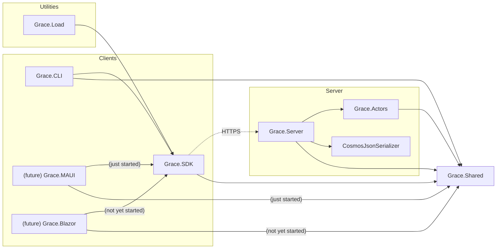

# Grace Version Control System

grace _(noun)_ [^grace] -

1. elegance and beauty of movement, form, or expression
2. a pleasing or charming quality
3. goodwill or favor
4. a sense of propriety and consideration for others

## Welcome to Grace.

Grace is a **new**, **modern**, **cloud-native** **version control system**.

Grace is **easy to use**, **easy to understand**, and **consistently fast**. And it's **powerful**, ready to handle large repositories and large file sizes.

Grace is meant to run in the background, making it **ambient**, **faster**, and **more valuable to your everyday work** as a developer.

Grace **connects you with others** working in your repository, **across the globe**, **in real-time**, enabling **new experiences** and **new ways of sharing**.

to be clear:
> Grace is **new** 🧑🏼‍🔬 and **alpha-level** right now. 🔥🧯 It is deeply incomplete. Grace is not currently meant to be relied on or used for anything other than its own development and testing (including playing with it to give feedback, of course).[^git]

## FAQ

For a list of (mostly imagined) frequently asked questions, please see the [Frequently Asked Questions](docs/Frequently%20asked%20questions.md) page.

## Vision

A lot of this remains to be built, but here's what I expect V1 to look like.

### No more fear

Stop being afraid of your version control system, and start _enjoying_ it instead.

Grace is explicitly designed to be easy to use, and easy to understand. (And powerful.)

There are many fewer concepts to understand in Grace, so learning it is easy, and understanding what it's doing is easy.

There's a simple-to-understand grammar, built-in aliases for common gestures, and common-sense defaults.

Grace is source control without fear.

### Yes, it's fast

Grace UX requires great speed.

Grace CLI is lightweight, self-documenting, and responsive.

Grace's GUI apps will be platform-native, with all of the performance and responsiveness that native apps have always had.

Grace Server is designed to run on fast, cloud-scale PaaS services for maximum speed, and uses networked, in-memory caching of data extensively.

(To really speed things up, Grace Server can precompute views and projections that you're likely to want, like diffs and directory contents, so that almost all requests are served from cached data... and Grace will garbage-collect them when they're no longer needed.)

### grace watch

Grace CLI includes a command - `grace watch` - that watches your working directory for changes, and keeps a live connection to Grace Server, connecting you in real-time to your team around the world.

`grace watch` takes action for you, whether that's automatically uploading and downloading new file versions, processing notifications from other repo users, or running custom actions that you create.

### Commits... and saves, checkpoints, and promotions

In Git, `commit` is an overloaded concept. It can mean:

- "I'm partially done" - doing a local commit after each unit of work
- "I'm really done" - this one is for the pull request
- Even merges get called `commits`.

And then you get the "squash" vs. "don't squash" debate. Sigh.

Grace simplifies this by breaking these usages out into their own commands:

- `grace promote` - this is sort-of a merge; it's what you'd get after approving a PR, which Grace calls a  _promotion review_[^pr]
- `grace commit` - this is "I'm really done" or "This version is a candidate for promotion"; you'd use a commit for a PR
- `grace checkpoint` - this means "I'm partially done", for you to keep track of your own progress
- `grace save` - this is used by `grace watch` for saving versions of files between checkpoints, because...

### Every save uploaded

By default, `grace watch` uploads new file versions (and new directory versions with recomputed SHA-256 hashes) after every save-on-disk. This lets Grace give you some very cool things, like:

- **file-level undo** for as far back as your repository allows,
- very fast `grace checkpoint`, `grace commit`, and `grace promote`, and,
- a **Version History view** that will let you to flip through your versions, helping you remember what you were thinking, and enabling easy, instant restoration of any of your past changes.

### Full event log

One way to think about a repository is: it's just a way to store a set of changes - i.e. _things that happened_ - over time.

At its heart, Grace is event-sourced. That means that there's a global event log so you can see the who, what, where, and when of everything that happens in your repository, and even set up custom automation based on those events.

The event log can be viewed as a stream, and have analytics applied to it to detect... well, whatever you want.[^stream]

(And, of course, the event log enables auditing - an enterprise must-have.)

### Live, two-way client-server communication

When running `grace watch`, Grace uses [SignalR](https://dotnet.microsoft.com/en-us/apps/aspnet/signalr) to create a live, two-way communication channel between client and server.

This connection allows Grace to do everything it does to connect you to everyone else working in your repository in real-time. Events happening across the repository can trigger actions both locally and on the server.

And it lets you share your code with team members faster than ever.

### Shift left on merge conflicts

Merge conflicts suck. Finding out that you have one, when you thought you were already done with your work, is one of the most anxiety-inducing parts of coding. Grace helps you eliminate them by keeping your branch up-to-date.

When your parent branch (or any branch above that in the tree) gets updated, by default, `grace watch` will auto-rebase your branch on those changes, so you're always coding against the latest version that you'll have to merge with.

Almost all of the time, when you rebase, nothing bad happens. You don't even notice it. The rest of the time, auto-rebase lets you find out right away, fix it while you're in flow, and skip the conflict later.

Grace can't promise to eliminate all conflicts, but it can help to reduce them.

### Private branches, not forks

Grace won't have forks. With Grace, there's no need for forking entire repositories just to make contributions. In open-source repos, you just create a private branch against the repo, and then (as you'd expect) submit PR's to get your private branch's version promoted into `main` (or whatever branch).

Imagine a large, open-source project in Grace: dozens of contributors, each with private branches, working on a public project that remains securely controlled with ACL's. Everyone auto-rebased with every update to their parent branch, so there are no surprises later. No networks of forks to manage, no multiple entire copies of the repo. Just separate devs working on the same repo, securely, together.

### Simplified branching strategy

Grace's default branching strategy is called _single-step_ and is designed to help reduce merge conflicts, and to make it easier to work on and promote code to shipping branches (like `main`).

Single-step branching is, we hope, both easy-to-use and powerful enough to be all that you need to run your projects. (We're open to supporting other branching models in the future.)

There's a [separate page](docs/Branching%20strategy.md) that describes it in detail.

### Run large repositories

Got a lot of files? a lot of users? a lot of versions?

In short... got a monorepo?

No problem, Grace is ready for it. So far, Grace has been tested on repositories as large as 100,000 files with 15,000 directories, with excellent performance (if you're running `grace watch`).

### Store large files

Grace has no problem storing large files. Really large files. It's been tested with 10GB files - not that I think files that large belong in version control - and it should handle even larger files well.

Grace will let you specify how to handle those files, like only downloading them for the Design department, but not for Engineering. It's up to you.

### Native GUI

Yeah, I said it.

Grace will have a native GUI app for Windows, Mac, Android, and iOS. (And eventually Linux.[^mauilinux])

Take Grace with you wherever you go. Merge conflict UI, Version History view, repository browsing, current status and more... all running at full native speed on your devices.

### Web UI

And Grace will ship with a default web UI. Sometimes the best way to share information is using a URL.

CLI + Web UI + GUI... use Grace the way you want to.

### ACL's, down to the file level

Grace goes way beyond just repository-level permissions. Grace uses OpenID and OAuth2 to integrate with your AuthN and AuthZ providers. Want to lock down specific paths in your repository to specific users and groups? With Grace, you'll be able to.

### No stashing

Because `grace watch` automatically uploads new file versions after every save, and commands like `grace switch` ensure that everything in your working directory is preserved before switching to another branch or reference, there's no need to stash anything. Just `switch` and go.

### Branch-level control of reference types

Plan your branching strategy in greater detail than ever before. Grace lets you decide which kinds of references are enabled in each branch. 

For instance, `main` might enable promotions and tags, and disable commits, checkpoints, and saves.

Ordinary user branches might disable promotions, but enable everything else.

It's up to you.

### Ephemeral checkpoints and saves

Checkpoints and saves are features to help **you** be more productive, but we don't need to keep them forever. Grace allows you to control how long they're kept are kept in each repository. 72 hours? One week? A month? Or maybe just "keep the last 1,000 saves". It's up to you.

### Delete versions if you need to

Sometimes you need to delete a version, whether it's because a secret or password was accidentally checked in, or because of some other security issue. With the right permissions, you'll be able to remove bad versions of your code - with a permanent reference that says that you did.

### Pre-rendered diffs

Every time you run `grace promote`, `grace commit`, or `grace checkpoint`, and every time `grace watch` uploads a new version of a file, Grace Server can optionally pre-render diffs for you to see, either in the CLI or in the Version History view. This makes seeing your ongoing changes in the Version History view instantaneous.

They're automatically aged out and deleted after a configurable length of time, so they don't just sit there wasting resources forever.

### Optional file locking

If your repository includes large binary files, like edited video, graphics, or game artifacts, you need to make sure that only one person at a time edits each file. Grace will support optional file locking at the directory level to ensure that you don't have to re-do work.

(Don't worry... if you don't need file locking, you don't have to turn it on.)

### A simple Web API

Grace Server is a modern Web API application. Like Grace's CLI, the Web API is easy to use, and easy to understand.

Grace ships with a .NET SDK, which is simply a projection of the Web API into .NET (and which Grace CLI uses). SDK's for other platforms are welcomed as community contributions.

### SHA-256 hashes

Grace uses SHA-256 hashes to verify that the files that you save and commit are exactly the ones that get retrieved by clients. Grace will include a command to verify the SHA-256 hashes of all downloaded files.

### Local file cache

Grace maintains a local file cache of versions of files that it's downloaded, and prunes it regularly. When running `grace watch`, Grace can download new file versions from multiple branches in the background so your `grace switch` commands run nearly instantly.

### 2048 characters

When you're running `grace promote/commit/checkpoint/save/tag -m <some message>`... that _\<some message\>_ can be up to 2048 characters.

50 characters... I don't think so. Feel free to share details. The person you help might be future you.

### Import from Git / Export to Git

Yes, we know... it's hard to let go. Grace will perform an initial import from Git repo, and will export to a Git repo.[^gitexport]

### Operations (if you're thinking about hosting your own server)

Grace Server is a modern, cloud-native Web API application. It will ship in a container on Docker Hub. (Of course.)

Grace Server is designed to be easy to deploy and operate. It runs on your choice of dozens of cloud-native databases, components and services, using [Dapr](https://dapr.io), making it flexible and inherently scalable. Grace Server is stateless and scales up and down well using basic [KEDA](https://keda.sh/) counters.

## Design and Motivations

If you'd like to read about some of the design thinking and motivations behind Grace - topics like UX, performance, scalability, monorepos, Git, and more - please read [Design and Motivations](docs/Design%20and%20Motivations.md).

## Project structure

Grace is written primarily in [F#](https://learn.microsoft.com/en-us/dotnet/fsharp/what-is-fsharp), and is organized into nine .NET projects.

- **Grace.CLI** is the command-line interface for Grace.
- **Grace.Server** is an ASP.NET Core project that defines the Web API for Grace.
- **Grace.SDK** is a .NET class library that is a platform-specific projection of the Web API; it is used by Grace.CLI and wraps the HTTPS calls to Grace Server.
- **Grace.Actors** holds the code for the Actors in the system; it is used exclusively by Grace.Server.
- **Grace.Shared** is where all common code goes; it is used by all of the other **Grace.*** projects.
- _(future)_ **Grace.MAUI** will contain a native GUI for Grace for Windows, Android, MacOS, and iOS (and hopefully Linux).
- _(future)_ **Grace.Blazor** will be an ASP.NET Core project containing a web UI for Grace.
- **CosmosJsonSerializer** is a custom JSON serializer class, used when deploying Grace with Azure Cosmos DB.

An additional project, **Grace.Load**, is an experiment to create a load test for Grace.Server.

### Project diagram

> Solid lines indicate a .NET project reference. Dotted lines indicate network requests.

## Deployment

Grace Server will be shipped as a container, which will be made available on Docker Hub. Dapr's sidecar and actor placement processes are shipped as containers and are available on Docker Hub.

We intend to provide a Docker Compose template, as well as Kubernetes configuration for deployment, allowing for deployment to any major public cloud provider, as well as on-premises hardware.

[^grace]: Definition excerpted from https://www.thefreedictionary.com/grace.

[^git]: Grace currently uses Git for its source control, and runs Grace in the same directory as a means of testing. Officially self-hosting Grace's source code on Grace will, of course, happen when it's safe to.

[^pr]: They're not "pull requests" for Grace because there isn't a "pull" gesture in Grace.

[^stream]: One application of taking a streaming perspective on the event log that we hope to create is in detecting invalid sequences of events in Grace that would indicate bugs and/or attacks.

[^mauilinux]: Grace will have a native Linux app if the [.NET MAUI team adds support for Linux Desktop](https://github.com/dotnet/maui/discussions/339), which you should totally go give a thumbs-up to.

[^gitexport]: By default, Grace will export the latest state of each branch into a `git bundle` file. Exporting an entire Grace repository to Git can be an expensive operation, and isn't expected to be a commonly-used feature. Live two-way synchronization between Grace and Git is a non-goal.
