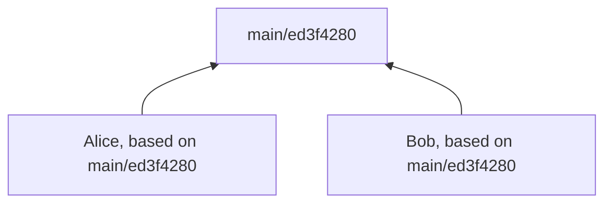
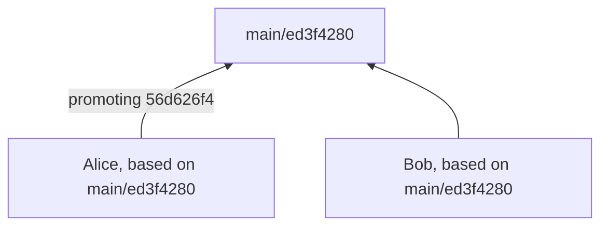
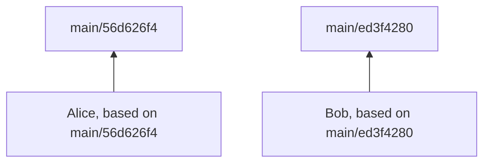
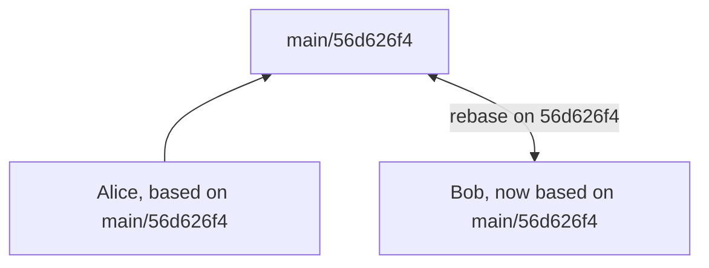

# Simplified branching strategy

> Quick note: Grace doesn't have a `merge` gesture; it has a `promote` gesture. The idea is that you're not merging a changeset into a parent branch, you're saying "The parent branch is changing its current version to point to the version in the child branch."

Grace's default branching strategy is meant to be simple, and to help surface merge conflicts as early as possible. It's called "single-step". If we're right, it's all you need to successfully run a project.

Branching strategy is the thing about Grace that's most different from other version control systems. Because it's so different, it's worth going over it in some detail.

In single-step branching, each child branch can be promoted only to its parent branch, and must be based on the most-recent version in the parent before being allowed to be promoted.

In other words: if I'm based on my parent branch, which means that my code includes everything in the parent branch, up to right now, then any changes in my branch are exactly equivalent to the changeset that we might imagine is being applied to the parent branch.

`grace watch` helps with single-step branching by auto-rebasing your branch when a parent branch's version changes. The vast majority of the time you'll be based on the most-recent parent version without having to do anything manually, and without noticing that anything happened. (And, yes, you can turn off auto-rebase if you need to.) (..but you should try it first.)

Here's a simple example:

Alice and Bob are developers in the same repo, and have individual branches, named `Alice` and `Bob`, parented by `main`.

When they do saves, checkpoints, or commits, those happen on their own branches.

When they promote, they promote only to `main`.

Grace keeps track of which version of their parent branch they're (re-)based on.

|Branch|Current version|Based on|
|-|-:|-:|
|Main|`ed3f4280`|\<root\>|
|Alice|`425684d8`|`ed3f4280`|
|Bob|`9c2afa14`|`ed3f4280`||Main|ed3f4280|ed3f4280|

Let's imagine that Alice makes one last update to her branch, has an updated SHA-256 value for it, and (assuming the PR is approved) promotes it to `main`.

|Branch|Current version|Based on|
|-|-:|-:|
|Main|`ed3f4280`|\<root\>|
|Alice|`56d626f4`|`ed3f4280`|
|Bob|`9c2afa14`|`ed3f4280`|

Everything goes well, Grace completes the promotion, and `main` is updated to point to the 56d626f4 version.

`Alice`, also pointing to 56d626f4, marks itself as based on it.

`Bob` is no longer based on the latest version in `main`, and is therefore ineligible to promote to `main`.

|Branch|Current version|Based on|
|-|-:|-:|
|Main|`56d626f4`|\<root\>|
|Alice|`56d626f4`|`56d626f4`|
|Bob|`9c2afa14`|`ed3f4280`|

Fortunately, Bob is running `grace watch`, so seconds later `Bob` is auto-rebased on that latest parent version in `main`.

Let's assume there are no conflicts.[^conflict] The files that were updated in `main` are different that then ones updated in `Bob`. The new file versions from `main` are copied into place in the working directory.

This new version of `Bob`, which includes whatever was already changed in the branch, and whatever changed in the rebase, has a new SHA-256 value, and is automatically uploaded as a save.

`Bob` is once again eligible to promote code to `main`.

|Branch|Current version|Based on|
|-|-:|-:|
|Main|`56d626f4`|\<root\>|
|Alice|`56d626f4`|`56d626f4`|
|Bob|`21519a1b`|`56d626f4`|

[^conflict]: If there are conflicts, Grace will have a native conflict-resolution UI, as well as a way to navigate it through the CLI.
