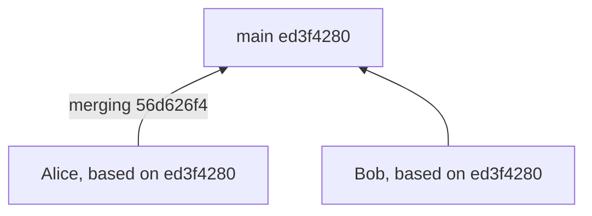
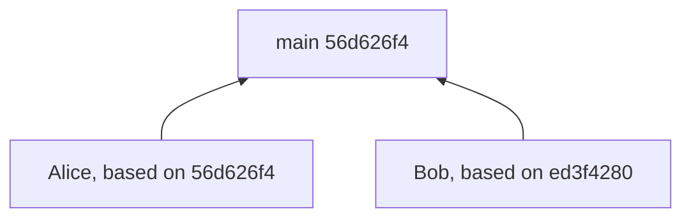
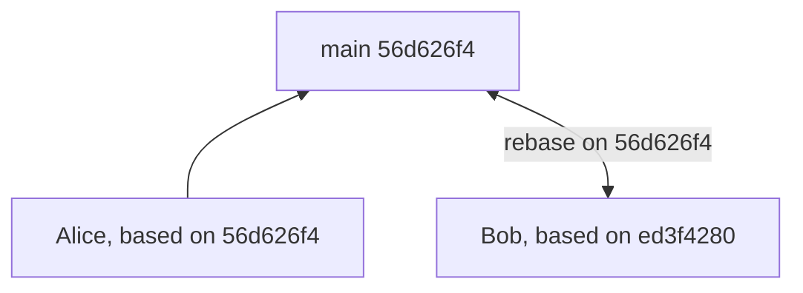
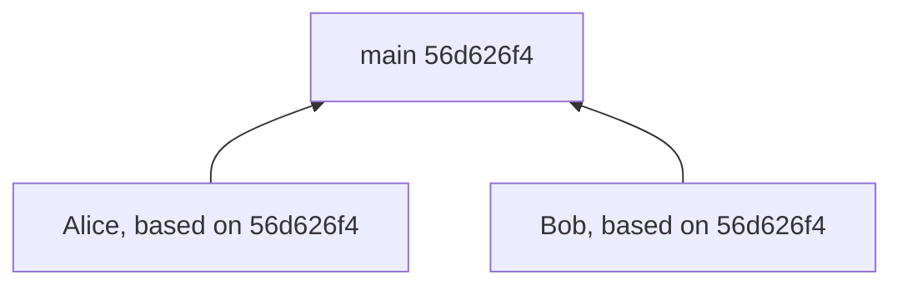

# Simplified branching strategy
Grace's default branching strategy is meant to be simple, and to help surface merge conflicts as early as possible. It's called "single-step". In most cases, it's all you need to successfully run a project.

In single-step branching, each child branch can merge only to its parent branch, and must be based on the most-recent merge in the parent before being allowed to merge.

Because `grace watch` auto-rebases your branch when a parent merge happens, the vast majority of the time you'll be based on the most-recent merge without having to do anything manually.

Here's an example:

---

`Alice` and `Bob` are developers in the same repo, and have individual branches parented by main. When they do saves, checkpoints, or commits, those happen on their own branches. When they merge, they merge only to `main`. They keep track of which version of their parent branch they're (re-)based on.

---

Let's imagine that Alice updates her branch, gets a different SHA-256 value for it, and merges to main.

---

Grace completes the merge, updating `main` to point to the 56d626f4 version. Alice's branch marks itself as based on it.

---

`Bob` can't merge to `main` until it is rebased on the new version of `main`, 56d626f4.

---

When running `grace watch`, that rebase will happen within seconds of the parent branch merge. Or you can run `grace rebase`. When it's done, both branches will be based on the current state of `main`.

