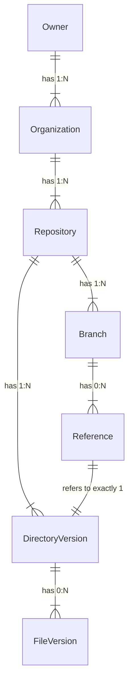

# Data types in Grace

Grace uses a fairly simple data structure to keep track of everything. It's more robust than Git's, for sure, but it's as simple as I could make it.

In this document, first, you'll find an Entity Relationship Diagram (ERD) showing the most relevant types.

After the diagram, you'll find descriptions of each data type. You can skip directly to the data type you're interested in by clicking the corresponding link below:

- [Owner and Organization](#owner-and-organization-ie-multitenancy)
- [Repository](#repository)
- [Branch](#branch)
- [DirectoryVersion](#directoryversion)
- [Reference](#reference)
- [FileVersion](#fileversion)

I'm sure the types will evolve a bit as we move towards a 1.0 release, but the overall structure should be stable now.

After those descriptions, at the bottom of this document, you'll find a [detailed entity relationship diagram](#detailed-entity-relationship-diagram). This ERD is incomplete, and there are, of course, many other data types in Grace. It's meant to illustrate the most interesting parts, to help you understand the structure of a repository and its contents. Please refer to it as you read the explanations of each type.

## Entity Relationship Diagram

The diagram below shows the most important data types in Grace, and how they relate to each other. A [more-detailed ERD](#detailed-entity-relationship-diagram) is available at the bottom of this document.

## Owner and Organization; i.e. Multitenancy

Grace has a lightweight form of multitenancy built-in. This structure is meant to help large version control hosting platforms to integrate Grace with their existing customer and identity systems.

I've specifically chosen to do have a two-level Owner / Organization structure based on my experience at GitHub. GitHub started with the construct of an Organization, and in recent years has been adding an "Enterprise" construct above Organizations, to allow large companies to have multiple Organizations managed under one structure. Seeing the importance of that feature set to large companies made it an easy decision to just start with a two-level structure.

It's not my intention for Grace to replace the identity / organization system for any hoster, and that's why there really isn't much in these data types. They're meant to be "hooks" that a hoster can refer to from their identity systems so they can implement whatever management features they need to safely serve Grace repositories.

Owner and Organization are the least-used of the data types here. They get created relatively infrequently, they get updated even less frequently, and they get deleted not much at all.

### What about personal accounts?

For individual users - like personal user accounts on GitHub that don't belong to any organization - Grace will have one Owner and one Organization that is just for that user, and all user-owned repositories would sit under that Organization.

There's nothing stopping an individual user from having multiple Organizations (unless the hoster prevents it). There's no performance difference either way.

## Repository

Now we get to the version control part.

Repository is where Grace keeps settings that apply to the entire repository, that apply to each branch by default, and that apply to References and DirectoryVersions in the repository.

Some examples:

- RepositoryType - Is the repository public or private?
- SearchVisibility - Should the contents of this repository be visible in search?
- Timings for deleting various entities -
  - LogicalDeleteDays - How long should a deleted object be kept before being physically deleted?
  - SaveDays - How long should Save References be kept?
  - CheckpointDays - How long should Checkpoint References be kept?
  - DirectoryVersionCacheDays - How long should the memoized contents of the entire directory tree under a DirectoryVersion be kept?
  - DiffCacheDays - How long should the memoized results of a Diff between two DirectoryVersions be kept?
- RecordSaves - Should Auto-save be turned on for this repository?

In general, once a Repository is created and the settings adjusted to taste, the Repository record will be updated very infrequently.

## Branch

Branch is where branches in a repository are defined. It just holds settings that apply to the Branch.

The most important settings there are:

- ParentBranchId - Which branch is the parent of this branch?
- \<_Reference_\>Enabled - These control which kinds of References are allowed on the Branch
  - PromotionEnabled
  - CommitEnabled
  - CheckpointEnabled
  - SaveEnabled
  - TagEnabled
  - ExternalEnabled

I'm sure there will be more settings here as we get to v1.0.

Branches are created and deleted frequently, of course, but they're updated pretty infrequently.

That might seem weird if you're used to Git. In Grace, when you do things like `grace checkpoint` or `grace commit` you're not updating the status of a Branch; you're creating a new Reference _in_ that branch. Nothing in the Branch itself changes.

## DirectoryVersion

DirectoryVersion holds the data for a specific version of a directory anywhere in a repo. Every time a file in a directory changes, a new DirectoryVersion is created that holds the new state of the directory. If the contents of a subdirectory change, that directory will get a new DirectoryVersion, and so will the next directory up the tree, until we reach the root of the repository.

In other words, DirectoryVersion is how we capture each unique state in a repository.

One interesting thing here is that, like the other entities here, Grace uses a Guid for the primary key DirectoryVersionId, and does not use the Sha256Hash as the unique key (even though it always will be unique). My reason for choosing to have an artificial key instead of just using the Sha256Hash is the challenge that Git has had, and is having, migrating to SHA-256, given how deeply embedded SHA-1 is in the naming of objects in Git. It seems best to keep Sha256Hash as a data field, and not as a key, to make it easier to change the hash algorithm in the future.

Also, DirectoryVersion has the RepositoryId it belongs to, but does not keep a BranchId. This is because a unique version of the Repository, i.e. a DirectoryVersion, can be pointed to from multiple References and from multiple Branches.

So, DirectoryVersion contains:

- DirectoryVersionId - This is a Guid that uniquely identifies each DirectoryVersion.
- RepositoryId - not BranchId
- Sha256Hash - Computed over the contents of the directory; the algorithms for computing the Sha256Hash of a [file](https://github.com/ScottArbeit/Grace/blob/337ed395b7f5d033ceb9d178b4fd9442fa383ee5/src/Grace.Shared/Services.Shared.fs#L53) and a [directory](https://github.com/ScottArbeit/Grace/blob/337ed395b7f5d033ceb9d178b4fd9442fa383ee5/src/Grace.Shared/Services.Shared.fs#L92) are in [Services.Shared.fs](https://github.com/ScottArbeit/Grace/blob/main/src/Grace.Shared/Services.Shared.fs).
- RelativePath - no leading '/'; for instance `src/foo/bar.fs`
- Directories - a list of DirectoryVersionId's that refer to the sub-DirectoryVersions.
- Files - a list of FileVersions, one for each not-ignored file in the directory
- Size - int64

DirectoryVersions are created and deleted frequently, as References are created and deleted.

### RootDirectoryVersion

Because it's such an important construct, in Grace's code you'll see `RootDirectoryVersion` a lot. This is a DirectoryVersion with the path '.', which is the [definition of "root directory"](https://github.com/ScottArbeit/Grace/blob/337ed395b7f5d033ceb9d178b4fd9442fa383ee5/src/Grace.Shared/Constants.Shared.fs#L173-L174) in Grace. Because the RootDirectoryVersion sits at the top of the directory tree, we point to it in a Reference, rather than any sub-DirectoryVersion, as representing a unique version of the repository.

## Reference

In Grace, a Reference is how we mark specific RootDirectoryVersions as being interesting in one way or another.

References have a ReferenceType that indicates what kind it is, so there's no such thing as a Commit entity or a Save entity. They're all just References.

The interesting parts of a Reference are:

- ReferenceId - This is a Guid that uniquely identifies each Reference.
- BranchId - The Branch that this Reference is in. A Reference can only be in one Branch.
- DirectoryVersionId - The RootDirectoryVersion that this Reference points to.
- Sha256Hash - The Sha256Hash of the DirectoryVersionId that this Reference points to. Denormalized here for performance reasons.
- ReferenceType - What kind of Reference is this?
  - Promotion - This is a Reference that was created by promoting a Commit reference from a child branch to this branch.
  - Commit - Commits are candidates for promotion.
  - Checkpoint - This is for you to mark a specific version of the repository as being interesting to you. In Git, this is what you'd think of as an intermediate commit as you complete your work.
  - Save - These are automatically created by Grace on every save-on-disk, if Auto-Save is turned on.
  - Tag - This is a Reference that was created by tagging a Reference.
  - External - This is a Reference that was created by an external system, like a CI system.
  - Rebase - This is the Reference that gets created when a branch is Rebased on the latest Promotion in its parent branch
- ReferenceType - The attached to the Reference.
- Links - This is a way to link this Reference to another in some relationship.

References and DirectoryVersions are where the action happens. New References and DirectoryVersions are being created with every save-on-disk (if you have Auto-Save turned on, which you should), and with every checkpoint / commit / promote / tag / external.

The ratio of new-DirectoryVersions-to-new-References is directly proportional to how deep in the directory tree the updated files are. For every directory level, a new DirectoryVersion will be created. For example, if I update a file called `src/web/js/lib/blah.js` and hit save, that will create one Save Reference, and five new DirectoryVersions - one for the root, and one each for each directory in the path.

Saves have short lifetimes, and checkpoints (by default) have longer, but finite, lifetimes, and they both get deleted at some point. Any DirectoryVersions that are unique to those references, and any FileVersions in object storage that only appear in those references, get deleted when the Reference is deleted.

Also, of course, every time a Branch is deleted, all References in that Branch get deleted. And all DirectoryVersions unique to those References get deleted. Etc.

It's completely normal in Grace for References to be deleted. Happens all the time.

## FileVersion

The FileVersion contains the metadata for a file in a DirectoryVersion. It's the metadata for the file, not the file itself.

The file itself is stored in object storage, and the FileVersion has a BlobUri that points to it.

The interesting parts of a FileVersion are:

- RepositoryId - The Repository that this FileVersion is in.
- RelativePath - The path of the file, relative to the Repository root.
- Sha256Hash - The Sha256Hash of the file.
- IsBinary - Is the file binary?
- Size - The size of the file (int64).
- BlobUri - The URI of the file in object storage.

## Detailed Entity Relationship Diagram

The diagram below shows the most important data types in Grace, and how they relate to each other. Not every field in each data type is shown - feel free to check out [Types.Shared.fs](https://github.com/ScottArbeit/Grace/blob/main/src/Grace.Shared/Types.Shared.fs) and [Dto.Shared.fs](https://github.com/ScottArbeit/Grace/blob/main/src/Grace.Shared/Dto/Dto.Shared.fs) to see the full data types - but this should give you a good idea of how the data is structured.

```mermaid
erDiagram
    Owner ||--|{ Organization : "has 1:N"
    Owner {
        OwnerId Guid
        OwnerName string
        OwnerType OwnerType
        SearchVisibility SearchVisibility
    }
    Organization ||--|{ Repository : "has 1:N"
    Organization {
        OrganizationId Guid
        OrganizationName string
        OwnerId Guid
        OrganizationType OrganizationType
        SearchVisibility SearchVisibility
    }
    Repository ||--|{ Branch : "has 1:N"
    Repository {
        RepositoryId Guid
        RepositoryName string
        OwnerId Guid
        OrganizationId Guid
        RepositoryType RepositoryType
        RepositoryStatus RepositoryStatus
        DefaultServerApiVersion string
        DefaultBranchName string
        LogicalDeleteDays double
        SaveDays double
        CheckpointDays double
        DirectoryVersionCacheDays double
        DiffCacheDays double
        Description string
        RecordSaves bool
    }
    Branch ||--|{ Reference : "has 1:N"
    Branch {
        BranchId Guid
        BranchName string
        OwnerId Guid
        OrganizationId Guid
        RepositoryId Guid
        UserId Guid
        PromotionEnabled bool
        CommitEnabled bool
        CheckpointEnabled bool
        SaveEnabled bool
        TagEnabled bool
        ExternalEnabled bool
        AutoRebaseEnabled bool
    }
    Repository ||--|{ DirectoryVersion : "has 1:N"
    Reference ||--|| DirectoryVersion : "refers to exactly 1"
    Reference {
        ReferenceId Guid
        DirectoryVersionId Guid
        Sha256Hash string
        ReferenceType ReferenceType
        ReferenceTest string
        Links ReferenceLinkType[]
    }
    DirectoryVersion {
        DirectoryVersionId Guid
        RepositoryId Guid
        RelativePath string
        Sha256Hash string
        Directories DirectoryVersionId[]
        Files FileVersion[]
    }
    DirectoryVersion ||--|{ FileVersion : "has 1:N"
    FileVersion {
        RepositoryId Guid
        RelativePath string
        Sha256Hash string
        IsBinary bool
        Size int64
        BlobUri string
    }
```

