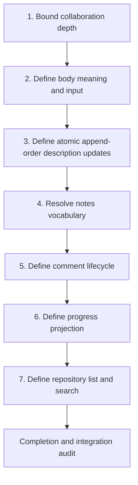

# Work-Item Coordination Surface Design Map

- **Status:** Exploratory; Section A is Plan-ready and in delivery
- **Quality contract:** Product V1
- **Canonical source:** `docs/Design concepts/Work-item coordination surface.md`
- **Evidence current through:** 2026-08-10, `epic/825-blob-backed-work-item-descriptions` at
  `bb2313aab5f8ed7be32a006ab2dd38911e027c50`

## Destination

Reach a Design-ready, then Plan-ready, contract for using Grace work items as the durable coordination surface for the
agent development workflow. The design should support replacing work-item intent, collaborating through comments, and
inspecting progress without treating attachments as comments or recreating GitHub's entire issue and pull-request model.

This document is a dependency-aware design map. It records delivered baseline behavior, current evidence, owner intent,
recommendations, and open decisions. It is not an implementation plan and does not authorize tracker setup or code
changes.

## Design sequence at a glance

Follow these stages in order. This is the order for closing design decisions, not a proposed issue or implementation
order. Work one owner decision at a time, update this document after each answer, and advance only when the current
stage's exit condition is satisfied.

> **Current stage: Stage 4 — notes vocabulary (DEC-008).** DEC-007 is accepted: supported description writes append in
> accepted actor order and the last appended description is current. There is no public revision, persisted revision,
> or compare-before-write requirement. DEC-006 keeps clear explicit and leaves earlier immutable objects retained.

| Stage | Decisions to close | Why it comes here | Exit condition before advancing |
| ----- | ------------------ | ----------------- | ------------------------------- |
| 1. Collaboration depth | DEC-003 and DEC-004 accepted | Removes or retains the expensive thread, resolution, and direct-edit capabilities before modeling comments. | Satisfied: V1 defers replies, resolution, direct editing, and edit history. |
| 2. Body meaning and input | DEC-005 and DEC-011 accepted | Defines the primary mutable resource and the long-Markdown workflow used by the first tracer. | Satisfied: the body meaning and exactly-one-source input behavior are coherent. |
| 3. Atomic description updates | DEC-006 and DEC-007 accepted | Completes the first bounded delivery section and establishes append-order last-write-wins for the body resource. | Set, clear, validation failure, immutable storage, and append-order behavior have one explicit contract. |
| 4. Notes vocabulary | DEC-008 | Opens the comments section by preventing a fourth overlapping notes concept before public names spread further. | Inline notes, attached evidence, structured review records, and comments have distinct names and ownership. |
| 5. Comment lifecycle | DEC-012 | Applies the Stage 1 capability boundary using the vocabulary and concurrency model established earlier. | Comment identity, creator, timestamp, ordering, correction, deletion, visibility, retry, and replay behavior are explicit. |
| 6. Progress projection | DEC-010 | A truthful activity view can be designed only after the complete update and comment event families are known. | Included event categories, ordering, pagination, and visibility are explicit, with no second write model. |
| 7. Repository list and search | DEC-009 | Listing and indexing depend on stable fields, visibility, comment behavior, and activity timestamps. | Repository scope, filters, ordering, pagination, indexed content, and deferred aggregation are explicit. |
| Completion audit | All accepted section contracts | Reconciles the delivered sections with the complete coordination outcome and catches propagation or integration gaps. | Every required row is implemented and proven, assigned, or given an explicit non-required disposition. |

### Progression rules

- Keep only one stage active in the owner conversation.
- After each accepted answer, update the decision ledger, capability inventory, domain model, proof implications, and
  candidate tracer before moving forward.
- If an answer adds replies, resolution, direct edits, another durable state machine, or a wider supported environment,
  return to Stage 1 and recompute the later stages.
- Repository research may prepare evidence for a later stage, but it must not silently decide that stage.
- Do not design activity or search semantics while update, comment, or visibility behavior is still open.

## Bounded delivery sections

The coordination surface will be completed through rolling section gates rather than waiting for the entire design to
be Plan-ready. The full design map remains the canonical contract, while each section must become independently
Plan-ready before its tracked implementation begins. Evidence from a completed section may refine later sections but
must not silently change their product behavior.

| Section | Decisions required before planning | User-visible outcome | Tracking shape |
| ------- | ---------------------------------- | -------------------- | -------------- |
| A. Work-item body mutation | DEC-005, DEC-011, DEC-006, DEC-007 | Replace the issue-like Markdown body through immutable repository-scoped content, with explicit clearing and append-order last-write-wins. | Plan-ready; #825 coordinates delivery, #826 is the inline create/set/show tracer, and #827 adds explicit clear with retained prior content. |
| B. Immutable comments | Accepted DEC-003 and DEC-004, plus DEC-008 and DEC-012 | Add, list, and explicitly correct chronological comments without replies, resolution, or direct editing. | Start after Section A establishes reusable immutable-content and append-order patterns; split only if the selected lifecycle adds another state machine. |
| C. Progress inspection | DEC-010 | Inspect a truthful read-only projection of meaningful work-item and collaboration activity. | One projection-focused section after update and comment events are stable. |
| D. Repository list and search | DEC-009 | Find work items within a repository using only stable, visible fields selected for V1. | One bounded discovery section; defer organization aggregation and comment-content search. |
| E. Completion audit | All accepted section contracts | Confirm propagation, proof, documentation, and integrated behavior across the complete coordination surface. | Final integration and audit work under the coordination epic. |

For every section: close only its blocking decisions, refresh repository evidence, add requirements and proof seams,
run the section-level Plan-ready audit, compile its issue packet, implement through the epic integration branch, and
feed only material findings back into the remaining design frontier.

## User-visible outcome

A Grace user or agent can use one work item to keep the current Markdown description of a task, record chronological
collaboration, and inspect meaningful progress. Competing supported description writes append in accepted actor order;
the last appended description is current.

The smallest plausible V1 provides:

- repeatable whole-body replacement for the work-item description;
- append-order last-write-wins with explicit clear-versus-omit behavior;
- no public history, previous-version link, or caller comparison value;
- first-class chronological comments distinct from attached evidence; and
- enough progress inspection to understand what changed and what collaborators said.

## Quality contract

Grace's Product V1 profile applies.

- Supported actors: authenticated Grace CLI, SDK, and HTTP API callers operating on work items in an accessible
  repository.
- Supported environment: current Grace development and early-user environments.
- Data posture: Grace is not in production. Current persisted and generated contracts may change directly; no
  production migration or compatibility machinery is required unless a later decision adds it.
- Durability: accepted work-item and comment mutations must survive actor restart and event replay.
- Concurrency: competing supported description writes append in serialized actor order, and the last accepted append is
  current without a caller comparison value.
- Failure behavior: validation and persistence failure must not publish partial success; an uncertain actor outcome
  retains its immutable object so the stable operation retry can converge.
- Public contract: CLI, HTTP API, SDK, OpenAPI, generated clients, machine-readable output, docs, and tests must agree.
- Deliberately absent unless reopened: high availability, disaster recovery automation, broad GitHub feature parity,
  cross-provider portability work, and compatibility aliases for replaced commands.
- Complexity stop: return to the owner if V1 gains threaded discussion resolution, comment edit history, a second new
  durable state machine, or organization-wide indexing before the core body-and-comment path is proven.

## Current-state evidence

| Evidence | Current behavior or contract | Relevance | Confidence or verification |
| -------- | ---------------------------- | --------- | -------------------------- |
| [Epic #810](https://github.com/ScottArbeit/Grace/issues/810) and [PR #819](https://github.com/ScottArbeit/Grace/pull/819) | `set-status`, typed attachment add, and recoverable attachment deletion are delivered. | These behaviors are baseline, not open design. | Merged and validated; exact integrated run is [31164179750](https://github.com/ScottArbeit/Grace/actions/runs/31164179750). |
| `docs/Work items.md` | Documents current create, show, status, link, attachment, and nonattachment-link workflows. | Defines the current user-facing work-item surface. | Current at the evidence revision. |
| `src/Grace.CLI/Command/WorkItem.CLI.fs` | Registers `create`, `show`, `set-status`, link operations, attachment operations, and link inspection/removal. It does not register general update, list, search, comments, or history commands. | Establishes the public CLI gap. | Current source was inspected. The local Debug executable is stale and was not used as current evidence. |
| `src/Grace.Server/WorkItem.Server.fs`, `buildUpdateCommands` and `Update` | Converts each non-empty update field to a separate actor command while reusing one metadata value. Empty strings are omitted. | Shows the existing general update is not a safe public body-edit contract. | Source-backed conclusion; a fresh runtime reproduction remains optional evidence work. |
| `src/Grace.Actors/WorkItem.Actor.fs`, `hasDuplicateCorrelationId` and `Handle` | Rejects a correlation ID already present in the WorkItem event stream. | Combined with the server loop, a multi-field request appears able to persist one field before rejecting the next. | Source-backed conclusion; verify through a focused hosted reproduction before implementation planning. |
| `src/Grace.Types/WorkItem.Types.fs`, `WorkItemDto`, and `src/Grace.Actors/WorkItem.Actor.fs`, `Get` and `GetEvents` | The actor persists an ordered list of events, while public `WorkItemDto` reads expose hydrated description text only. | The ordered event stream supplies append-order last-write-wins; public storage facts and revision-like values remain absent. | Current source inspected for #826. |
| `src/Grace.Types/WorkItem.Types.fs` | Contains inline `Notes`, `ReviewNotesIds`, and a links projection with `ReviewNotesArtifactIds`. | Confirms the current notes vocabulary collision. | Current source. |
| `src/Grace.Types/Artifact.Types.fs` and `src/Grace.Actors/Artifact.Actor.fs` | Own reviewer attachments have a generation-bound logical-delete and recovery lifecycle. | Comments must not reuse the attachment lifecycle. | Delivered and covered by focused and hosted tests. |
| `src/Grace.Server.Tests/WorkItem.Integration.Server.Tests.fs` | Proves attachment add, visibility, recovery, generic-unlink rejection, and final cleanup. | Protects the #810 baseline during later coordination work. | Current test source; #810 integrated validation passed. |

No named work-item source, test, or documentation path changed between the #810 merge commit
`af1aa306a3107bec13383069dfb812d54a3a5362` and the evidence revision.

## Delivered baseline that must remain true

- Canonical status mutation is `grace workitem set-status <work-item> --status <status>` with lowercase `-s`.
- Attachment creation is `grace workitem attachments add <work-item> --type <summary|prompt|notes>` with exactly one of
  `--file`, `--text`, or `--stdin`.
- Summary, prompt, and notes are classification values sharing one attachment lifecycle.
- Owned reviewer attachment deletion is logical and recoverable until its stored repository-retention deadline.
- Generic exact or type-based unlink cannot bypass owned attachment deletion.
- An attachment is evidence, input, or an agent result. It is not a first-class collaboration comment.
- Removed status, attachment-add, and bulk-unlink command shapes do not return as compatibility aliases.

## Capability inventory

| ID | Capability | Disposition | User-visible outcome and reason |
| -- | ---------- | ----------- | ------------------------------- |
| CAP-001 | #810 status and attachment lifecycle | Informational only | Delivered baseline; later work preserves it rather than redesigning it. |
| CAP-002 | Repeatable work-item body replacement | Required now | The owner wants the work-item description to carry evolving task intent like an issue body. Exact semantics remain open. |
| CAP-003 | Atomic multi-field work-item mutation | Required now | A request must not persist only its first accepted field and then fail. |
| CAP-004 | Competing description writes | Required now | Supported writes append in accepted actor order; the last appended description is current. No mismatch response, revision, or compare-before-write input is exposed. |
| CAP-005 | First-class chronological comments | Required now | Feedback and progress are immutable records in one flat stream. Corrections are new comments that explicitly identify the original. |
| CAP-006 | Progress inspection | Required now | Users need to understand meaningful state changes and collaboration. The projection shape remains open. |
| CAP-007 | Direct comment editing | Deferred | DEC-004 accepts immutable comments and explicit correction entries; direct editing and edit history are not part of V1. |
| CAP-008 | Replies and resolvable discussion threads | Deferred | DEC-003 accepts one chronological V1 stream. Responses are later comments, with no reply nesting or resolved discussion state. |
| CAP-009 | Organization-wide list and search | Deferred, recommended | Start with repository scope after the resource and visibility model stabilizes. Owner decision DEC-009 remains open. |
| CAP-010 | Full-text search of comment content | Deferred, recommended | Search visibility depends on comment correction and deletion semantics that are not yet closed. |
| CAP-011 | Attachment modification, replacement, or bulk deletion | Deferred | Explicitly deferred by #810. |
| CAP-012 | Treating attachment unlink as deletion | Rejected | Contradicts the delivered recoverable lifecycle. |
| CAP-013 | Treating an attachment as a comment | Rejected | Loses comment identity, ordering, creator, timestamp, and collaboration lifecycle. |
| CAP-014 | Arbitrary deletion of nonattachment artifacts | Out of scope | Not part of the work-item coordination outcome. |

Deferred recommendations in this inventory are not owner decisions. They remain open until their linked decision closes.

## Decision ledger

Rows are ordered by the stage in which they should be closed, not by decision ID.

| ID | Stage | Decision or question | Lane | Status | Decision or recommendation | Design and proof impact | Owner | Propagation |
| -- | ----- | -------------------- | ---- | ------ | -------------------------- | ----------------------- | ----- | ----------- |
| DEC-001 | Baseline | What remains settled from #810? | Scope | Accepted | Preserve the delivered status and owned-attachment contracts without compatibility aliases. | Adds regression obligations but no new design scope. | Owner through #810 | Baseline, capability inventory, proof |
| DEC-002 | Baseline | What coordination outcome is required? | Product | Accepted | Work items should support evolving task intent, comments or feedback, and progress recording now handled through GitHub issues and pull requests. | Establishes the design destination. | Owner | Outcome, required capabilities |
| DEC-003 | 1 | Does V1 require replies and resolvable threads? | Scope | Accepted | Use one chronological stream; responses are later comments. Defer replies and resolved discussion state. | Removes nesting and a discussion-resolution state machine from V1. | Owner | Comment model, capability inventory |
| DEC-004 | 1 | Are comments directly editable? | Product | Accepted | Comments are immutable. A correction is a new comment with its own identity, creator, and timestamp plus an explicit reference to the original. Defer direct editing and edit history. | Preserves append-only history and removes comment edit conflicts from V1. | Owner | Comment state, history, search |
| DEC-005 | 2 | Is `Description` the issue-like Markdown body? | Domain | Accepted | `Description` is one replaceable Markdown body containing the task's current intent, purpose, and acceptance context; `Title` remains separate. | Defines the main update contract and long-input workflow without structured sections or patch operations. | Owner | Domain language, CLI, API, SDK |
| DEC-011 | 2 | What is the public long-text workflow? | Product | Accepted | Accept exactly one of `--text`, `--file`, or `--stdin`; defer interactive editing, structured sections, and patch-language input. | Defines one convergent CLI input contract plus parsing and inert introspection proof. | Owner | CLI, docs, tests |
| DEC-006 | 3 | What distinguishes set and clear? | Product | Accepted | Use `workitem description set` and `workitem description clear`. Set requires exactly one non-empty `--text`, `--file`, or `--stdin` source; empty input fails with guidance to use clear. The API and SDK represent set, clear, and omission distinctly. | Removes empty-string ambiguity and gives scripts an explicit clear operation. | Owner | Parameters, validation, serialization, CLI, API, SDK |
| DEC-007 | 3 | What determines the current description when supported callers compete? | Architecture | Accepted | Append-order last-write-wins. The serialized actor accepts descriptions in order; the last appended description is current. Do not add a public or persisted revision, previous-version link, or compare-before-write requirement. | Requires ordered actor projection, stable retry identity, and last-append proof; removes revision propagation and mismatch proof. | Owner decision, 2026-08-10 | Actor, internal projection, API/SDK/CLI hydration, tests, docs |
| DEC-008 | 4 | How should the three notes concepts be named? | Domain | Open | Recommend reserving `comment` for collaboration, keeping structured review records explicit, and renaming the attachment classification away from bare `notes`; exact label needs a vocabulary pass. | Prevents a fourth overlapping notes concept. | Owner | Types, CLI, docs, generated contracts |
| DEC-012 | 5 | What is the V1 comment lifecycle? | Product | Open | After Stage 1 closes, define identity, creator, timestamp, ordering, correction, deletion, visibility, duplicate-request, and replay behavior inside that boundary. | Establishes the durable comment contract consumed by activity and search. | Owner | Types, actor, API, SDK, CLI, events, tests |
| DEC-010 | 6 | Is progress one combined activity timeline? | Product | Open | Recommend a read-only projection combining WorkItem changes and comments; do not create a second write model. | Requires stable event categories and visibility rules after updates and comments are defined. | Owner | Events, server projection, CLI, tests |
| DEC-009 | 7 | What list and search scope belongs in V1? | Scope | Open | Recommend repository-scoped list first, then title/body search; defer organization aggregation and comment-content search. | Avoids indexing unsettled visibility and lifecycle behavior. | Owner | API, search projection, CLI |

## Provisional domain language

These terms are recommendations until their linked decisions close.

| Term | Provisional meaning | Must not mean |
| ---- | ------------------- | ------------- |
| Work-item body | The current replaceable Markdown description of the task, its purpose, and acceptance context. | A chronological log or attached file. |
| Comment | A chronological collaboration entry with its own identity, creator, and timestamp. | An Artifact or a mutable work-item field. |
| Correction | A later comment that explicitly corrects an earlier comment while preserving the original record. | An invisible rewrite of history. |
| Activity entry | A read-only projection of a durable WorkItem change or comment event. | A second mutation endpoint or duplicate state store. |
| Attached evidence | Prompt, agent summary, or review-related file/text content governed by the #810 lifecycle. | A comment or discussion thread. |
| Structured review record | A review-domain object referenced by `ReviewNotesIds`. | Inline work-item notes or generic attachment text. |
| Append order | The accepted serialized order of description events; the final accepted description is current. | A public revision, history API, previous-version link, or caller comparison value. |

The design must still decide whether inline `WorkItemDto.Notes` remains a supported concept, is renamed, or is removed.

## Decision frontier

This is the detailed execution view of the sequence shown near the top of the document. Work these stages in numerical
order, keep only one stage active, and do not promote a later stage merely because its question appears easier.

### Stage 1: collaboration depth

**Accepted decisions:**

- DEC-003: V1 uses one chronological comment stream. A response is an ordinary later comment; comments have no reply
  nesting or resolved and unresolved discussion state.
- DEC-004: Comments are immutable. A correction is a new comment with its own identity, creator, and timestamp plus an
  explicit reference to the comment it corrects. Direct editing and edit history are deferred.

**Stage result:** V1 has one append-only comment resource without nested discussion, resolution state, or comment edit
conflicts.

**Accepted risk:** A flat immutable stream may be less convenient for long review conversations and typo correction.
V1 accepts that cost so comment value can be proven before adding thread structure, resolution state, or edit history.

**Exit condition:** Satisfied. DEC-003 and DEC-004 are accepted, and the capability inventory reflects both decisions.

### Stage 2: body meaning and input

**Accepted decisions:**

- DEC-005: `Description` is the canonical issue-like work-item body: one replaceable Markdown value containing the
  task's current intent, purpose, and acceptance context, with `Title` remaining separate.
- DEC-011: The CLI accepts body Markdown from exactly one of `--text`, `--file`, or `--stdin`. Interactive editing,
  structured sections, and patch-language input are deferred.

**Stage result:** All three long-text paths converge on the same whole-body replacement operation. Supplying no source
or multiple sources fails validation without changing the work item.

**Exit condition:** Satisfied. DEC-005 and DEC-011 define the body meaning, replacement model, accepted content sources,
and exactly-one-source behavior.

### Stage 3: atomic description updates

**Accepted decision (DEC-006):** The CLI uses `workitem description set|clear`. `set` requires exactly one non-empty
`--text`, `--file`, or `--stdin` source. File and standard-input readers complete before one unchanged text string is
sent through the existing set request; they do not trim, normalize line endings, or rewrite Unicode. Empty, missing,
unreadable, absent, or multiple sources fail before a request with guidance to use `clear`. The API and SDK represent
set, clear, and omission distinctly rather than overloading an empty string.

**Accepted decision (DEC-007):** Supported description writes use append-order last-write-wins. The serialized actor
accepts each valid append; the last accepted description is current. No public or persisted revision, compare-before-
write input, mismatch response, history traversal, or previous-version link is added.

**Repository evidence:** The actor already persists ordered events. #826 replaces description strings with immutable
`Description` and `TextContent` references, retains only the current reference in the internal projection, and hydrates
only current UTF-8 text at the public read boundary.

**Failure and retry:** A failed validation or known actor rejection publishes no description. A stable operation identity
lets an ambiguous retry find and verify its immutable object. Objects from earlier successful sets, explicit clear, or
uncertain outcomes remain retained; no public history exposes them.

**Exit condition:** Satisfied. DEC-006 and DEC-007 define set, explicit clear, validation failure, immutable storage,
retry, and append-order last-write-wins.

When this exit condition is satisfied, Section A can receive its section-level readiness audit and issue packet without
waiting for the comments, activity, or search sections.

### Stage 4: notes vocabulary

**Question:** Which existing notes concepts remain, and what public name replaces the attachment classification
currently exposed as `notes`?

**Why it blocks:** Comments should not create another ambiguous notes surface.

**Recommendation:** Reserve comment vocabulary for collaboration and choose a distinct evidence-oriented attachment
label during a focused domain-modeling pass.

**Exit condition:** DEC-008 gives inline notes, attached evidence, structured review records, and comments distinct
names and ownership boundaries.

### Stage 5: comment lifecycle

**Question:** What identity, creator, timestamp, ordering, correction, deletion, and visibility contract applies to a
comment under the V1 scope selected by Stage 1?

**Why it blocks:** Activity and search cannot be truthful until comment visibility and history are stable.

**Exit condition:** DEC-012 defines the complete supported comment lifecycle, including duplicate requests, restart,
and replay.

### Stage 6: progress projection

**Question:** Does one read-only activity timeline combine body changes, status changes, comments, links, and attachment
lifecycle events, or should some resources remain separate?

**Why it blocks:** It determines event projection, pagination, visibility, and proof surfaces.

**Recommendation:** Project one combined timeline while keeping resource-specific read commands available.

**Exit condition:** DEC-010 defines included event categories, ordering, pagination, visibility, and how activity affects
the work item's updated time.

### Stage 7: list and search

**Question:** Which repository-scoped fields, filters, ordering, pagination, and searchable content are required for V1?

**Why it blocks:** Search must index only stable fields and visible content.

**Recommendation:** Start with repository list plus status and updated-time filters, then title/body search. Defer wider
aggregation and comment-content search.

**Exit condition:** DEC-009 defines repository scope, filters, ordering, pagination, indexed fields, visibility, and the
capabilities deferred beyond V1.

### Completion and integration audit

Run this after Sections A through D complete. Reconcile the accepted decisions, implemented behavior, contract
propagation, documentation, proof, and residual risk across the complete coordination surface. Reassess the original
outcome and tracer against what was delivered.

**Exit condition:** Every required traceability row is implemented and proven, assigned to explicit remaining work, or
given a deferred, waived, rejected, out-of-scope, or informational disposition. Integrated behavior passes the final
epic review and validation gates.

## Candidate value-bearing tracer

The #826 tracer is one inline whole-body replacement through the nearest stable public boundary. #827 extends that
same boundary with explicit clear while retaining prior immutable content:

1. Create or resolve a work item and set its Markdown body with inline `--text`.
1. Observe one successful durable transition and a hydrated public description with no storage facts.
1. Set two different descriptions and observe that the last accepted actor append is current.
1. Retry one operation identity and prove the immutable object is verified rather than silently reused for different
   content.
1. Keep help, schema, examples, and parse failures inert. Clear appends an empty immutable Description without a blob,
   retains earlier objects, and does not expose history. The remaining accepted long-input forms are separate Section A
   delivery obligations.

This tracer crosses shared contracts, actor persistence, server validation, SDK, CLI, public output, tests, and docs. It
does not require comments, activity aggregation, or search, so evidence from it can refine those later decisions.

This tracer implements the settled DEC-007 contract without broadening into comments, activity, search, public history,
or cross-provider storage.

## Likely propagation surfaces

The final specification must give each row an explicit updated, unchanged, deferred, waived, or not-applicable
disposition.

| Surface | Likely relevance | Current design status |
| ------- | ---------------- | --------------------- |
| `Grace.Types` WorkItem DTOs, commands, events, persisted state | Internal immutable description reference, current projection, comment identities and events | #826 updates description storage; later comment decisions remain pending |
| `Grace.Shared` parameters and validators | Dedicated description request, explicit clear/omit distinction, comment requests | #826 updates inline set; remaining Section A forms are planned |
| WorkItem actor | Ordered description append, current projection, replay | #826 updates description path; comments remain pending |
| Server handlers and routes | Update, comment, activity, list, and search behavior | Pending decisions |
| Endpoint access rules | Stored-resource scope and list filtering | Pending decisions |
| SDK facade | Thin methods aligned to accepted routes and DTOs | Pending decisions |
| CLI and executable output registry | Update/body, comments, activity, list/search, long-text input | Pending decisions |
| Static OpenAPI and generated clients | Every accepted public route and shape | Pending decisions |
| Events, webhooks, SignalR, Watch, and search projections | Classify accepted WorkItem and comment events or record specific non-applicability | Pending decisions |
| Tests | Pure contract, actor replay/concurrency, server behavior, CLI parsing/output, generated freshness | Pending decisions |
| Documentation and agent guidance | Work-item workflows, vocabulary, lifecycle, and future implementation guidance | Pending decisions |

## Proof implications

The Plan-ready specification will need false-positive-resistant proof for at least:

- one atomic multi-field success and one validation failure that leaves every field unchanged;
- explicit omitted, clear, and replace behavior;
- two callers setting different descriptions, with the last accepted actor append current;
- actor restart and event replay preserving the current body, ordered description events, comments, and selected ordering;
- duplicate request behavior without duplicate comments or transitions;
- comment identity, creator, timestamp, order, correction, deletion, and visibility semantics selected for V1;
- activity pagination and event classification without duplicating or hiding supported entries;
- repository list/search filtering that does not reveal inaccessible work items;
- CLI normal and JSON output, `--select`, `--schema`, `--examples`, help, and parse-failure behavior;
- OpenAPI and generated-client freshness for every accepted public contract; and
- regression coverage for the #810 attachment lifecycle and generic-unlink rejection.

Exact proof seams and requirement IDs will be added after the dependent owner decisions close. Until then, this section
records expected proof classes rather than claiming traceability coverage.

## Fog

These in-scope concerns are not yet sharp enough to decide before the earlier frontier closes:

- whether comments need logical deletion, redaction, or only correction entries;
- whether a comment belongs directly to a work item or optionally to a future discussion;
- whether activity needs a durable projection or can be assembled from existing event streams within acceptable query
  bounds;
- whether `UpdatedAt` is derived from the latest WorkItem event, latest comment, or combined activity;
- whether title/body search uses the existing search infrastructure or a narrower repository projection;
- maximum body and comment sizes and whether Markdown needs content-type metadata; and
- how comment additions and body updates appear in webhooks or SignalR notifications.

Promote a fog item into the decision frontier only when an earlier answer makes it concrete and current-scope.

## Explicitly out of scope for this design pass

- Reopening the #810 status or attachment lifecycle.
- Treating attachments as comments.
- Arbitrary nonattachment Artifact deletion.
- General-purpose social collaboration beyond work-item coordination.
- Reactions, mentions, subscriptions, notification preferences, or rich-text editing.
- Cross-provider integrations that mirror GitHub issues or pull requests.
- Organization-wide indexing before repository-scoped behavior proves its value.
- Production-data migration or legacy compatibility machinery.

## Readiness status

**Assessed state:** Exploratory.

The artifact passes these early criteria:

- destination and Product V1 profile are explicit;
- #810 baseline behavior is separated from the remaining scope;
- current source gaps and source-backed inference are recorded;
- capability reductions and the easiest overbuild are visible;
- decision dependencies and a provisional tracer are explicit; and
- likely public, durable, generated, event, documentation, and proof surfaces are mapped.

The complete coordination surface is not Design-ready because the notes vocabulary, comment lifecycle, activity
projection, and list/search scope remain open. Section A is Design-ready and Plan-ready; its bounded delivery is in
progress. Individual
bounded sections may advance to Plan-ready and tracked implementation once their own decisions, requirements,
propagation dispositions, and proof seams are closed without depending on unresolved later behavior.

It is not Plan-ready because required scenarios, functional requirements, complete state and failure models, final
propagation dispositions, and requirement-to-proof traceability depend on those owner decisions.

## Self-critique

- Strongest element: the ordering prevents activity and search from defining the resource model backward.
- Accepted Stage 1 risk: a flat immutable comment stream may not be sufficient for every feedback conversation or
  correction workflow Grace wants to move away from GitHub; richer discussion and edit history remain deferred until
  experience demonstrates the need.
- Highest-risk dependency: the current-description projection must preserve accepted append order while keeping immutable
  storage facts, prior objects, and uncertain retry evidence out of public contracts.
- Easiest way to overbuild: clone editable threaded discussions, resolution, notifications, and organization-wide search
  before the body-and-comment path is proven.
- Easiest way to under-test: prove only successful updates and comments while missing partial persistence, ordered
  competing sets, duplicate requests, replay, corruption, and hidden-resource filtering.
- Simpler alternative: whole-body replacement plus append-only comments and resource-specific reads, with no combined
  activity or search in the first release.

## Next action

Complete the bounded Section A delivery under #825, starting with #826's inline immutable-text tracer, before
broadening the active frontier. Ask DEC-008 only:

> Which existing notes concepts remain, and what public name replaces the attachment classification currently exposed as
> `notes`?

After the owner answers, update this canonical artifact and continue only through the decisions required for Section B.
