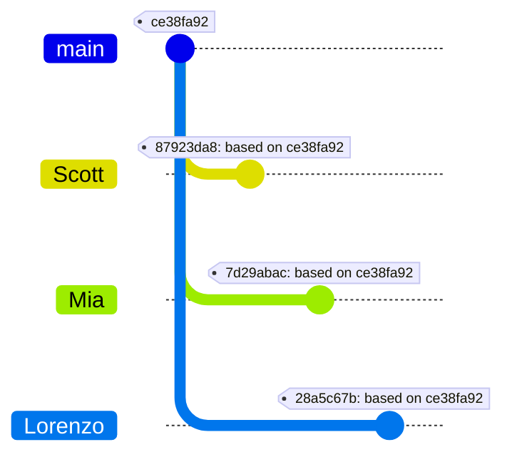
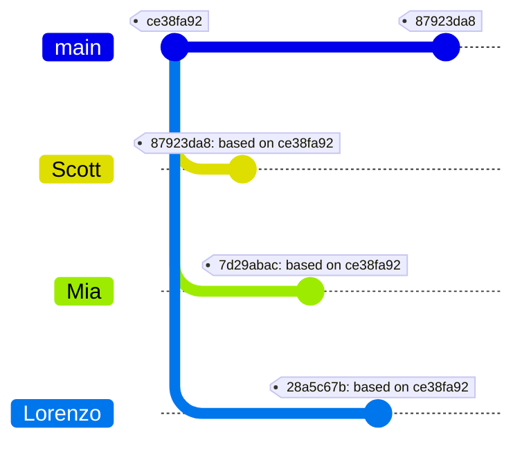
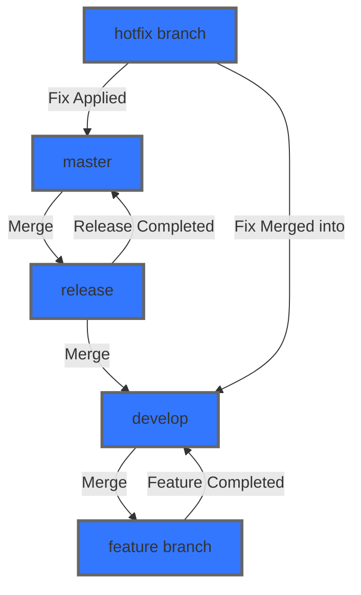

# Mermaid diagrams

## Starting state

```mermaid
%%{init: { 'logLevel': 'debug', 'theme': 'default', 'gitGraph': {'showBranches': true, 'showCommitLabel': false}} }%%
    gitGraph
        commit tag: "ce38fa92"
        branch Scott
        branch Mia
        branch Lorenzo
        checkout Scott
        commit tag: "87923da8: based on ce38fa92"
        checkout Mia
        commit tag: "7d29abac: based on ce38fa92"
        checkout Lorenzo
        commit tag: "28a5c67b: based on ce38fa92"
        checkout main
```

## A promotion on `main`

```mermaid
%%{init: { 'logLevel': 'debug', 'theme': 'default', 'gitGraph': {'showBranches': true, 'showCommitLabel': false}} }%%
    gitGraph
        commit tag: "ce38fa92"
        branch Scott
        branch Mia
        branch Lorenzo
        checkout Scott
        commit tag: "87923da8: based on ce38fa92"
        checkout Mia
        commit tag: "7d29abac: based on ce38fa92"
        checkout Lorenzo
        commit tag: "28a5c67b: based on ce38fa92"
        checkout main
        commit tag: "87923da8"
```

## Branching model

```mermaid
graph TD;
    A[master] -->|Merge| B[release];
    B -->|Merge| C[develop];
    C -->|Merge| D[feature branch];
    D -->|Feature Completed| C;
    B -->|Release Completed| A;
    E[hotfix branch] -->|Fix Applied| A;
    E -->|Fix Merged into| C;

    classDef branch fill:#37f,stroke:#666,stroke-width:3px;
    class A,B,C,D,E branch;
```
