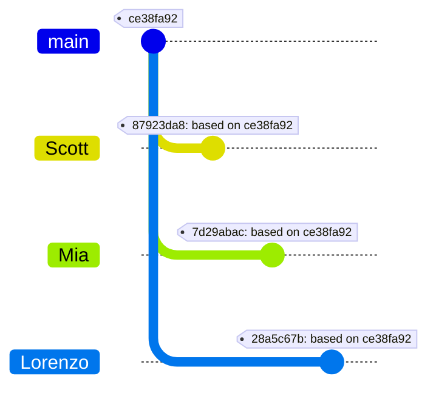
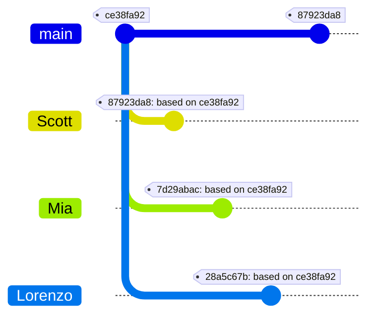
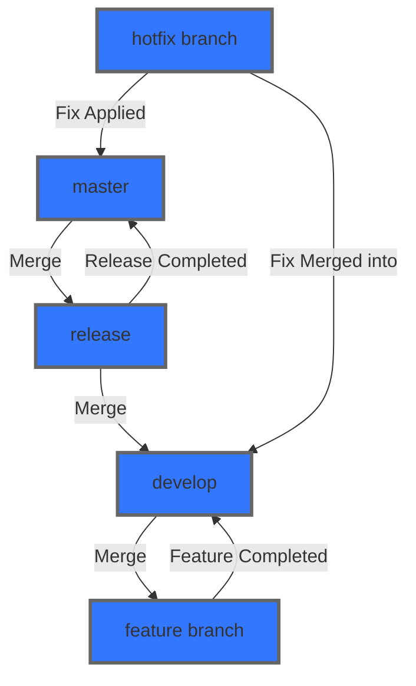
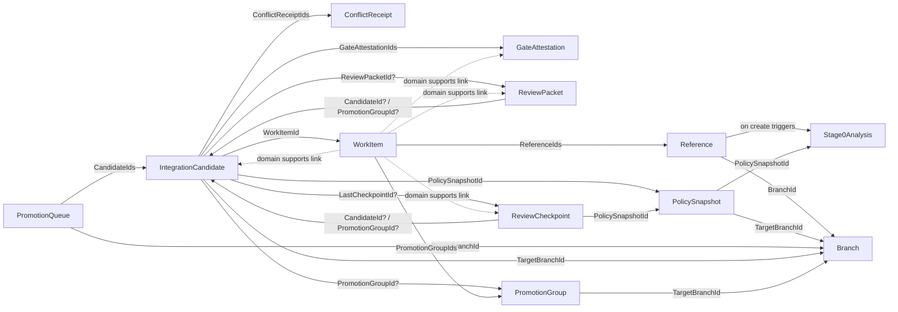
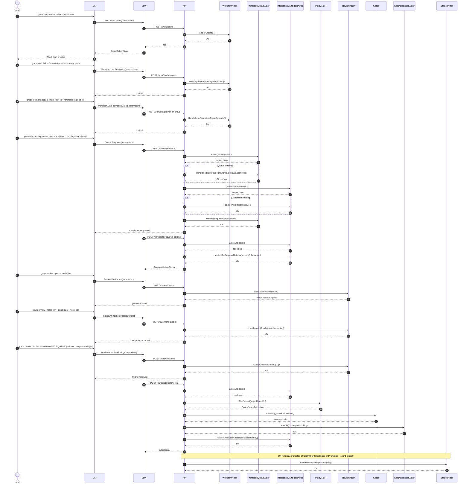
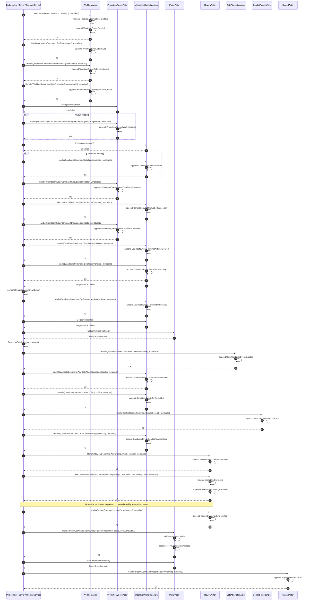

# Mermaid diagrams

## Starting state

```mermaid
%%{init: { 'logLevel': 'debug', 'theme': 'default', 'gitGraph': {'showBranches': true, 'showCommitLabel': false}} }%%
    gitGraph
        commit tag: "ce38fa92"
        branch Scott
        branch Mia
        branch Lorenzo
        checkout Scott
        commit tag: "87923da8: based on ce38fa92"
        checkout Mia
        commit tag: "7d29abac: based on ce38fa92"
        checkout Lorenzo
        commit tag: "28a5c67b: based on ce38fa92"
        checkout main
```

## A promotion on `main`

```mermaid
%%{init: { 'logLevel': 'debug', 'theme': 'default', 'gitGraph': {'showBranches': true, 'showCommitLabel': false}} }%%
    gitGraph
        commit tag: "ce38fa92"
        branch Scott
        branch Mia
        branch Lorenzo
        checkout Scott
        commit tag: "87923da8: based on ce38fa92"
        checkout Mia
        commit tag: "7d29abac: based on ce38fa92"
        checkout Lorenzo
        commit tag: "28a5c67b: based on ce38fa92"
        checkout main
        commit tag: "87923da8"
```

## Branching model

```mermaid
graph TD;
    A[master] -->|Merge| B[release];
    B -->|Merge| C[develop];
    C -->|Merge| D[feature branch];
    D -->|Feature Completed| C;
    B -->|Release Completed| A;
    E[hotfix branch] -->|Fix Applied| A;
    E -->|Fix Merged into| C;

    classDef branch fill:#37f,stroke:#666,stroke-width:3px;
    class A,B,C,D,E branch;
```

## Work item and related entities

```mermaid
  flowchart LR
    B[Branch]
    R[Reference]
    P[PolicySnapshot]
    S0[Stage0Analysis]
    Q[PromotionQueue]
    C[IntegrationCandidate]
    G[GateAttestation]
    CR[ConflictReceipt]
    RP[ReviewPacket]
    CK[ReviewCheckpoint]
    WI[WorkItem]
    PG[PromotionGroup]

    R -->|BranchId| B
    R -->|on create triggers| S0
    P -->|PolicySnapshotId| S0

    P -->|TargetBranchId| B
    Q -->|TargetBranchId| B
    C -->|TargetBranchId| B
    PG -->|TargetBranchId| B

    Q -->|CandidateIds| C
    C -->|PolicySnapshotId| P
    C -->|WorkItemId| WI
    C -->|PromotionGroupId?| PG
    C -->|GateAttestationIds| G
    C -->|ConflictReceiptIds| CR
    C -->|ReviewPacketId?| RP
    C -->|LastCheckpointId?| CK

    RP -->|CandidateId? / PromotionGroupId?| C
    CK -->|CandidateId? / PromotionGroupId?| C
    CK -->|PolicySnapshotId| P

    WI -->|ReferenceIds| R
    WI -->|PromotionGroupIds| PG
    WI -.domain supports link.-> C
    WI -.domain supports link.-> RP
    WI -.domain supports link.-> CK
    WI -.domain supports link.-> G
```

## Sequence diagram #1

```mermaid
  sequenceDiagram
      autonumber
      actor U as User
      participant CLI
      participant SDK
      participant API
      participant WI as WorkItemActor
      participant Q as PromotionQueueActor
      participant IC as IntegrationCandidateActor
      participant POL as PolicyActor
      participant REV as ReviewActor
      participant G as Gates
      participant GA as GateAttestationActor
      participant S0 as Stage0Actor

      U->>CLI: grace work create --title --description
      CLI->>SDK: WorkItem.Create(parameters)
      SDK->>API: POST /work/create
      API->>WI: Handle(Create(...))
      WI-->>API: Ok
      API-->>SDK: 200
      SDK-->>CLI: GraceReturnValue
      CLI-->>U: Work item created

      U->>CLI: grace work link ref <work-item-id> <reference-id>
      CLI->>SDK: WorkItem.LinkReference(parameters)
      SDK->>API: POST /work/link/reference
      API->>WI: Handle(LinkReference(referenceId))
      WI-->>API: Ok
      API-->>CLI: Linked

      U->>CLI: grace work link group <work-item-id> <promotion-group-id>
      CLI->>SDK: WorkItem.LinkPromotionGroup(parameters)
      SDK->>API: POST /work/link/promotion-group
      API->>WI: Handle(LinkPromotionGroup(groupId))
      WI-->>API: Ok
      API-->>CLI: Linked

      U->>CLI: grace queue enqueue --candidate --branch [--policy-snapshot-id]
      CLI->>SDK: Queue.Enqueue(parameters)
      SDK->>API: POST /queue/enqueue
      API->>Q: Exists(correlationId)?
      Q-->>API: true or false

      alt Queue missing
          API->>Q: Handle(Initialize(targetBranchId, policySnapshotId))
          Q-->>API: Ok or error
      end

      API->>IC: Exists(correlationId)?
      IC-->>API: true or false

      alt Candidate missing
          API->>IC: Handle(Initialize(candidate))
          IC-->>API: Ok
      end

      API->>Q: Handle(Enqueue(candidateId))
      Q-->>API: Ok
      API-->>CLI: Candidate enqueued

      SDK->>API: POST /candidate/required-actions
      API->>IC: Get(candidateId)
      IC-->>API: candidate
      API->>IC: Handle(SetRequiredActions(actions)) if changed
      IC-->>API: Ok
      API-->>SDK: RequiredActionDto list

      U->>CLI: grace review open --candidate
      CLI->>SDK: Review.GetPacket(parameters)
      SDK->>API: POST /review/packet
      API->>REV: GetPacket(correlationId)
      REV-->>API: ReviewPacket option
      API-->>CLI: packet or none

      U->>CLI: grace review checkpoint --candidate --reference
      CLI->>SDK: Review.Checkpoint(parameters)
      SDK->>API: POST /review/checkpoint
      API->>REV: Handle(AddCheckpoint(checkpoint))
      REV-->>API: Ok
      API-->>CLI: checkpoint recorded

      U->>CLI: grace review resolve --candidate --finding-id --approve or --request-changes
      CLI->>SDK: Review.ResolveFinding(parameters)
      SDK->>API: POST /review/resolve
      API->>REV: Handle(ResolveFinding(...))
      REV-->>API: Ok
      API-->>CLI: finding resolved

      SDK->>API: POST /candidate/gate/rerun
      API->>IC: Get(candidateId)
      IC-->>API: candidate
      API->>POL: GetCurrent(targetBranchId)
      POL-->>API: PolicySnapshot option
      API->>G: runGate(gateName, context)
      G-->>API: GateAttestation
      API->>GA: Handle(Create(attestation))
      GA-->>API: Ok
      API->>IC: Handle(AddGateAttestation(attestationId))
      IC-->>API: Ok
      API-->>SDK: attestation

      Note over API,S0: On Reference.Created of Commit or Checkpoint or Promotion, record Stage0
      API->>S0: Handle(Record(stage0Analysis))
      S0-->>API: Ok
```

### Sequence diagram #2

```mermaid
    sequenceDiagram
      autonumber
      participant ORCH as Orchestrator (Server / Internal Service)
      participant WI as WorkItemActor
      participant Q as PromotionQueueActor
      participant IC as IntegrationCandidateActor
      participant POL as PolicyActor
      participant REV as ReviewActor
      participant GA as GateAttestationActor
      participant CR as ConflictReceiptActor
      participant S0 as Stage0Actor

      %% Work item command flow
      ORCH->>WI: Handle(WorkItemCommand.Create(...), metadata)
      WI->>WI: validate (duplicate correlation, exists?)
      WI->>WI: append WorkItemEvent.Created
      WI-->>ORCH: Ok

      ORCH->>WI: Handle(WorkItemCommand.SetStatus(status), metadata)
      WI->>WI: append WorkItemEvent.StatusSet
      WI-->>ORCH: Ok

      ORCH->>WI: Handle(WorkItemCommand.LinkReference(referenceId), metadata)
      WI->>WI: append WorkItemEvent.ReferenceLinked
      WI-->>ORCH: Ok

      ORCH->>WI: Handle(WorkItemCommand.LinkPromotionGroup(groupId), metadata)
      WI->>WI: append WorkItemEvent.PromotionGroupLinked
      WI-->>ORCH: Ok

      %% Queue + candidate initialization/enqueue
      ORCH->>Q: Exists(correlationId)?
      Q-->>ORCH: true/false
      alt Queue missing
          ORCH->>Q: Handle(PromotionQueueCommand.Initialize(targetBranchId, policySnapshotId), metadata)
          Q->>Q: append PromotionQueueEvent.Initialized
          Q-->>ORCH: Ok
      end

      ORCH->>IC: Exists(correlationId)?
      IC-->>ORCH: true/false
      alt Candidate missing
          ORCH->>IC: Handle(CandidateCommand.Initialize(candidate), metadata)
          IC->>IC: append CandidateEvent.Initialized
          IC-->>ORCH: Ok
      end

      ORCH->>Q: Handle(PromotionQueueCommand.Enqueue(candidateId), metadata)
      Q->>Q: append PromotionQueueEvent.CandidateEnqueued
      Q-->>ORCH: Ok

      %% Candidate lifecycle commands
      ORCH->>IC: Handle(CandidateCommand.SetStatus(Canceled), metadata)
      IC->>IC: append CandidateEvent.StatusSet(Canceled)
      IC-->>ORCH: Ok
      ORCH->>Q: Handle(PromotionQueueCommand.Dequeue(candidateId), metadata)
      Q->>Q: append PromotionQueueEvent.CandidateDequeued
      Q-->>ORCH: Ok

      ORCH->>IC: Handle(CandidateCommand.ClearRequiredActions, metadata)
      IC->>IC: append CandidateEvent.RequiredActionsCleared
      IC-->>ORCH: Ok
      ORCH->>IC: Handle(CandidateCommand.SetStatus(Pending), metadata)
      IC->>IC: append CandidateEvent.StatusSet(Pending)
      IC-->>ORCH: Ok
      IC-->>ORCH: IntegrationCandidate
      ORCH->>ORCH: computeRequiredActions(candidate)
      ORCH->>IC: Handle(CandidateCommand.SetRequiredActions(actions), metadata)
      IC->>IC: append CandidateEvent.RequiredActionsSet
      IC-->>ORCH: Ok

      %% Gate rerun flow
      ORCH->>IC: Get(correlationId)
      IC-->>ORCH: IntegrationCandidate
      ORCH->>POL: GetCurrent(correlationId)
      POL-->>ORCH: PolicySnapshot option
      ORCH->>ORCH: Gates.runGate(gateName, context)
      ORCH->>GA: Handle(GateAttestationCommand.Create(attestation), metadata)
      GA->>GA: append GateAttestationEvent.Created
      GA-->>ORCH: Ok
      ORCH->>IC: Handle(CandidateCommand.AddGateAttestation(attestationId), metadata)
      IC->>IC: append CandidateEvent.GateAttestationAdded
      IC-->>ORCH: Ok

      %% Conflict pipeline (internal)
      ORCH->>IC: Handle(CandidateCommand.AddConflict(conflict), metadata)
      IC->>IC: append CandidateEvent.ConflictAdded
      IC-->>ORCH: Ok
      ORCH->>CR: Handle(ConflictReceiptCommand.Create(receipt), metadata)
      CR->>CR: append ConflictReceiptEvent.Created
      CR-->>ORCH: Ok
      ORCH->>IC: Handle(CandidateCommand.AddConflictReceipt(receiptId), metadata)
      IC->>IC: append CandidateEvent.ConflictReceiptAdded
      IC-->>ORCH: Ok

      %% Review command flow
      ORCH->>REV: Handle(ReviewCommand.AddCheckpoint(checkpoint), metadata)
      REV->>REV: append ReviewEvent.CheckpointAdded
      REV-->>ORCH: Ok

      ORCH->>REV: Handle(ReviewCommand.ResolveFinding(findingId, resolution, resolvedBy, note), metadata)
      REV->>REV: validate packet/finding exists
      REV->>REV: append ReviewEvent.FindingResolved
      REV-->>ORCH: Ok

      Note over ORCH,REV: UpsertPacket is actor-supported command used by internal processes
      ORCH->>REV: Handle(ReviewCommand.UpsertPacket(packet), metadata)
      REV->>REV: append ReviewEvent.PacketUpserted
      REV-->>ORCH: Ok

      %% Policy acknowledge flow
      ORCH->>POL: Handle(PolicyCommand.Acknowledge(policySnapshotId, userId, note), metadata)
      POL->>POL: validate snapshot exists
      POL->>POL: append PolicyEvent.Acknowledged
      POL-->>ORCH: Ok

      %% Stage0 record flow (triggered from reference events)
      ORCH->>POL: GetCurrent(correlationId)
      POL-->>ORCH: PolicySnapshot option
      ORCH->>S0: Handle(Stage0Command.Record(stage0Analysis), metadata)
      S0->>S0: append Stage0Event.Recorded
      S0-->>ORCH: Ok
```