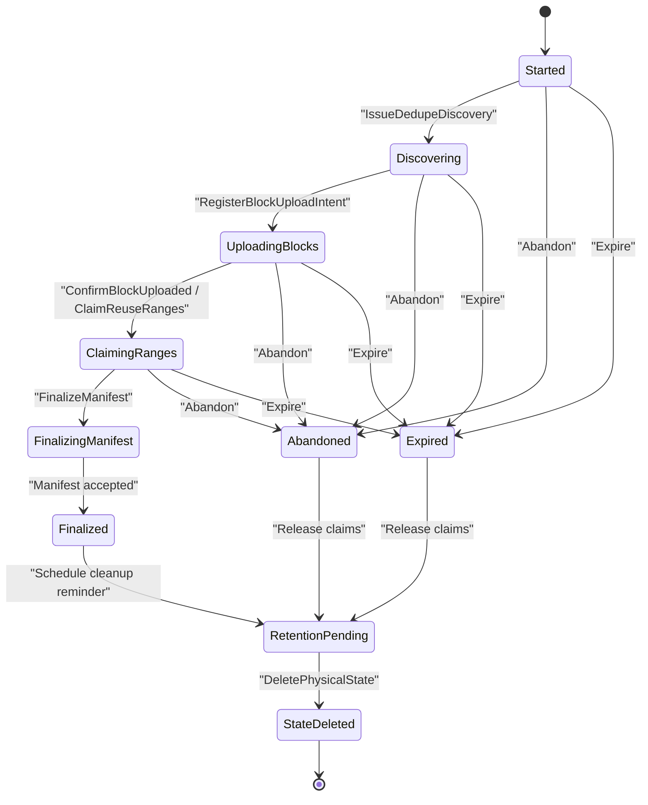

# Use ContentBlock-based content-addressed storage for large manifest-backed files

Grace will store small and regular files as repository-scoped `WholeFileContent`, and will store eligible large files
through `FileManifest`, `ContentBlock`, and `ContentBlockRange` content-addressed storage. This gives Grace
StoragePool-wide dedupe for large content without introducing per-chunk actors, per-chunk reference counters, or a
client-visible chunk existence oracle.

## Context

Grace currently has path-shaped upload behavior centered on `FileVersion` and object-storage paths. That implementation
is useful evidence about today's service surface, but Grace is not in production, so it is not a migration constraint.
The CAS design can move directly to the right architecture.

The new storage model has to satisfy several goals at once:

- Preserve Grace's path-aware repository model, where a `FileVersion` says a specific relative path contains specific
  content in a repository version.
- Move file bytes into path-independent content-addressed storage.
- Keep ordinary source files and small files operationally simple.
- Support large-file dedupe across repositories within a `StoragePool`.
- Avoid a direct or indirect API that tells an unauthorized client whether arbitrary content already exists.
- Keep actor state, reference counting, compaction, and retries tractable.
- Allow Grace Cache and future storage backends to reuse content without depending on physical object paths.

The design is inspired by Xet's separation between small logical chunks and larger block-like storage units, but it is
not a copy of Xet's upload lifecycle. Grace adds its own actor workflow, repository contribution accounting, range-claim
checks, and upload-session retention behavior.

## Decision

Grace will use a two-path content model:

```text
FileVersion
  -> FileContentReference
       -> WholeFileContent
       -> FileManifest
              -> ContentBlockRange[]
                    -> ContentBlock
                          -> ContentChunk[]
```

`WholeFileContent` is repository-scoped. It does not participate in StoragePool-wide global dedupe.

`FileManifest`, `ContentBlock`, `ContentBlockMetadata`, and `ContentChunk` are the large-file CAS path. The durable
identity and lifecycle boundaries are intentionally not one actor, row, blob, or counter per chunk.

## Content Path Selection

`ManifestEligibilityPolicy` belongs to a repository and decides whether a new file version is stored as
`WholeFileContent` or as manifest-backed content. Grace v1 uses these defaults:

- Binary files enter the manifest-backed path when uncompressed size is greater than or equal to 1 MiB.
- Text files enter the manifest-backed path when Grace-defined compressed size is greater than or equal to 1 MiB.
- Binary detection reuses Grace's Git-style detector: scan the first 8 KiB for a NUL byte.
- Repositories may later add file-type, extension, or path rules to the eligibility policy.

The policy is evaluated when a `FileVersion` is created. The resulting `FileContentReference` is immutable and is the
source of truth. Later policy changes do not reinterpret old file versions.

`ManifestEligibilityPolicy` decides whether content enters the manifest-backed path. It does not change the chunking
algorithm.

## Chunking Suite

Manifest-backed content uses a fixed, versioned `ChunkingSuite`. Grace v1 uses:

- Rabin chunking.
- BLAKE3 chunk identity.
- Target chunk size: 64 KiB.
- Minimum chunk size: 8 KiB.
- Maximum chunk size: 128 KiB.

`ChunkAddress` is the canonical lowercase 64-character BLAKE3 hash of a `ContentChunk`'s unencoded bytes. Compression,
transfer encoding, repository policy, path, object key, and storage provider are not part of chunk identity.

Compatible Grace clients and caches use the same `ChunkingSuite` so chunks can be reused. Repositories do not tune chunk
sizes independently.

## FileManifest Identity

`FileManifest` is the server-accepted reconstruction description for one complete logical file:

```fsharp
type FileManifest =
    { ManifestAddress: ManifestAddress
      FileContentHash: FileContentHash
      TotalUncompressedSize: int64
      ChunkingSuiteId: string
      ContentBlockRanges: ContentBlockRange array
      CreatedAt: Instant }

type ContentBlockRange =
    { ContentBlockAddress: ContentBlockAddress
      OrdinalStart: int32
      OrdinalCount: int32
      UncompressedSize: int64 }
```

`ManifestAddress` is content-derived from the manifest reconstruction contract. It includes:

- Address-family context.
- Manifest format version.
- File content hash.
- Total uncompressed size.
- Chunking suite id.
- Ordered `ContentBlockRange` entries.
- Each range's `UncompressedSize`.

`ManifestAddress` excludes:

- Repository id.
- Path.
- Upload session id.
- Actor id.
- Storage provider.
- Object key.
- Compression and transfer encoding.
- Repository policy that caused the manifest path to be selected.

Including range `UncompressedSize` is deliberate. Range size is part of the reconstruction contract Grace validates, so
two manifests that disagree about range size must not share one identity.

## ContentBlock Identity

`ContentBlock` is Grace's ordered, Xorb-like aggregation unit for large manifest-backed content. It is the storage,
transfer, dedupe, and GC unit. `ContentChunk` remains a logical chunk concept and is not a standalone persisted entity,
actor, or per-chunk lifecycle counter.

Grace v1 targets about 64 MiB of uncompressed chunk content per `ContentBlock`.

`ContentBlockAddress` is content-derived from:

- Address-family context.
- Compact block format version.
- Ordered `ChunkAddress` sequence.

`ContentBlockAddress` excludes:

- Per-chunk uncompressed length.
- Encoded offsets and encoded lengths.
- Compression and encoding flags.
- Object key, ETag, storage shard, or storage provider.
- Active manifest counts and lifecycle state.
- Repository policy or manifest eligibility settings.

This allows Grace to compact or move physical storage without changing logical reconstruction identity.

## Physical ContentBlock Format

The v1 physical block payload is a compact framed format:

```text
magic/version
header length
chunk count
chunk table:
  chunk ordinal
  ChunkAddress
  uncompressed length
  encoded offset
  encoded length
  encoding flags
payload frames in ordinal order
block checksum/trailer
```

The chunk table is physical payload metadata. It is not part of the `ContentBlockAddress` except where the compact block
format version participates in the address preimage.

## ContentBlockMetadata

`ContentBlockMetadata` is the mutable storage and lifecycle companion to `ContentBlock`:

```fsharp
type ContentBlockMetadata =
    { ContentBlockAddress: ContentBlockAddress
      BlockFormatVersion: int16
      StoragePlacement: ContentBlockStoragePlacement
      Ranges: ContentBlockMetadataRange array
      TotalPhysicalBytes: int64
      ActivePhysicalBytes: int64
      MetadataVersion: int64
      UpdatedAt: Instant }

type ContentBlockMetadataRange =
    { OrdinalStart: int32
      OrdinalCount: int32
      ActiveManifestCount: int32
      PhysicalOffset: int64
      PhysicalLength: int64 }
```

`ContentBlockMetadataRange` presence is the physical presence signal:

- Range exists and `ActiveManifestCount > 0`: physical bytes exist and are active.
- Range exists and `ActiveManifestCount = 0`: physical bytes exist but are reclaimable.
- Range is absent: physical bytes are not present for that logical range and cannot be claimed by a new manifest.

Grace removes reclaimed ranges instead of storing a permanent reclaimed flag or tombstone.

All claim and compaction updates to `ContentBlockMetadata` use whole-record optimistic concurrency through a
`MetadataVersion` or storage ETag. A stale dedupe hint is safe because a range claim must reread and update authoritative
metadata before finalization.

## Client Upload Flow

For manifest-backed content, the client performs chunking and proposes content, but Grace Server remains authoritative
for authorization, physical range presence, range claims, and final manifest acceptance.

The client-side flow is:

1. Apply the repository's `ManifestEligibilityPolicy`.
2. Compute `FileContentHash` over the full unencoded file bytes.
3. Apply the active `ChunkingSuite` to unencoded bytes.
4. Compute each `ChunkAddress` from unencoded chunk bytes.
5. Deduplicate locally within the file and upload batch.
6. Select sparse global dedupe anchors.
7. Ask the authorized `UploadSession` for candidate windows.
8. Scan protected candidate windows for contiguous reuse runs.
9. Ask Grace Server to claim reused ranges.
10. Build and upload new `ContentBlock` payloads for non-reused runs.
11. Submit a `FileManifest` proposal.
12. Let Grace Server finalize only after validating reconstruction, range claims, block presence, file hash, and size.

The correctness fallback is always to upload bytes. Dedupe is an optimization, not an authority.

## Existence-Oracle Protection

Grace must not expose a direct or practical `exists(ChunkAddress)` oracle.

Grace v1 uses sparse key chunks and protected candidate windows:

```text
isKeyChunk(chunkAddress, chunkOrdinal):
  if chunkOrdinal == 0:
    return true
  value = littleEndianUInt64(last 8 bytes of BLAKE3 chunk digest)
  return value % 256 == 0
```

The server surfaces the sampling policy through upload-session configuration. The policy is derived and deterministic;
it is not durable chunk state.

Discovery responses are bounded:

- `MaxKeyChunksPerRequest = 256`.
- `MaxCandidateWindowsPerKeyChunk = 4`.
- `MaxWindowChunks = 256`.
- `MaxResponseProtectedChunks = 16_384`.
- `ResponseTtl = 5 minutes`.
- `MinimumAcceptedReuseRun = max(8 chunks, about 1 MiB)`.

Dedupe responses return candidate `ContentBlock` windows, not raw per-chunk existence answers. Candidate chunk addresses
are response-protected so a client can match against its own local chunk sequence without learning a raw inventory of
neighboring chunks.

An empty, partial, stale, unauthorized, over-limit, or rate-limited response does not prove content absence. A positive
reuse result does not prove global content existence until the upload session claims a physically present
`ContentBlockMetadataRange` and the manifest finalizes.

## Fragmentation Rule

Grace optimizes for reconstructable contiguous runs, not maximum per-chunk dedupe.

Grace accepts a dedupe run only when it clears the minimum reuse threshold. If an isolated chunk match would fragment a
file, Grace may intentionally duplicate that chunk into a new `ContentBlock`.

This is a deliberate trade-off:

- Slightly less perfect dedupe.
- Fewer `ContentBlockRange` entries.
- Better reconstruction locality.
- Less metadata fan-out.
- Fewer read-time block fetches.

## UploadSession Actor

Grace uses one `UploadSession` per manifest-backed file. Batch upload creates many upload sessions.

`UploadSession` is keyed by `UploadSessionId`, using a GUID-keyed actor shape. Each session owns:

- One repository.
- One authorized write scope.
- One `FileContentHash`.
- One expected total file size.
- One `ChunkingSuiteId`.
- One sampling policy snapshot.
- Discovery responses and expirations.
- Block upload intents.
- Claimed reuse ranges and expirations.
- At most one finalized `ManifestAddress`.

Commands use explicit operation ids for idempotency. Correlation ids remain diagnostic context, not retry identity.

```fsharp
type UploadSessionCommand =
    | Start of StartUploadSession
    | IssueDedupeDiscovery of DiscoveryOperationId * DedupeKeyChunk array
    | RegisterBlockUploadIntent of BlockUploadOperationId * ContentBlockAddress
    | ConfirmBlockUploaded of BlockUploadOperationId * ContentBlockAddress
    | ClaimReuseRanges of ClaimOperationId * ContentBlockRange array
    | FinalizeManifest of FinalizeOperationId * FileManifest
    | Abandon of AbandonOperationId
    | Expire of ExpireOperationId
    | DeletePhysicalState of DeletePhysicalStateOperationId
```

The session lifecycle is:



After finalization, abandon, or expiration, the actor schedules a repository-configured reminder to delete its physical
state after the diagnostic and retry window. That cleanup deletes only upload coordination state. It does not delete
accepted `FileManifest` records, `ContentBlock` payloads, `ContentBlockMetadata`, or contribution accounting.

## Manifest Contribution Accounting

Grace keeps repository fan-in separate from StoragePool-level content lifecycle.

`RepositoryContentCounter` is repository-scoped state for one StoragePool-shared CAS target. For manifest-backed
content, the target is the `ManifestAddress`. The counter absorbs repeated live references inside one repository:

```text
(RepositoryId, ManifestAddress).ReferenceCount
  0 -> 1: add the repository's manifest contribution
  1 -> 0: remove the repository's manifest contribution
  N -> N+1, where N > 0: no block fan-out
  N -> N-1, where N > 1: no block fan-out
```

`ManifestContributionWorkflow` is keyed by `(RepositoryId, ManifestAddress)`. It is workflow state, not a relational row
and not an upload-session child. The workflow actor owns:

- The manifest contribution operation ids that have already been applied.
- Whether an increment or decrement contribution is pending, active, completed, or failed.
- Bounded fan-out progress across the manifest's `ContentBlockRange` entries.
- Retry state for range liveness updates.
- The ability to resume after activation, crash, or timeout.

A save that introduces a manifest-backed `FileVersion` is complete only after the increment intent for
`(RepositoryId, ManifestAddress)` is durably recorded. The full block-range fan-out may complete asynchronously with
retry. Garbage collection and compaction must treat a pending contribution workflow as live enough to prevent deleting
the manifest or ranges it is in the process of making active.

This keeps user-facing saves responsive without letting accepted manifests outrun content retention.

## Dedupe Index Maintenance

The dedupe index is rebuildable discovery metadata.

Grace writes dedupe index entries only after:

- New block upload has completed.
- Reused ranges have been claimed.
- The `FileManifest` has finalized.
- The authoritative `ContentBlockMetadata` state reflects physical range presence.

Stale index entries are expected and safe. Range-claim checks against `ContentBlockMetadata` remain authoritative.
Compaction can publish maintenance work or let future misses age stale candidates out. Rebuilding the index from
finalized manifests and block metadata must be a valid recovery path.

## Compaction

Compaction rewrites physical payload placement without changing `ContentBlockAddress` or logical chunk ordinals.

Grace v1 selects compaction candidates only when:

- `ReclaimablePhysicalBytes >= max(64 MiB, 10% of TotalPhysicalBytes)`.
- Reclaimable ranges are at least 24 hours old.
- The block is not under active upload, finalization, range-claim, or compaction churn.
- Optimistic metadata concurrency confirms active counts before any range is removed.

Transaction break-even is a sanity check, not the primary compaction trigger. Churn control, batching, age, and
concurrency safety dominate.

## Rejected Alternatives

### Per-chunk actors or rows

Grace will not create a `ContentChunkActor`, per-chunk row, per-chunk lifecycle counter, or per-chunk physical deletion
reminder. That approach creates too many durable objects, makes deletion and fan-out expensive, and encourages a
chunk-existence-shaped API.

### Global dedupe for WholeFileContent

Grace will not globally dedupe small or regular files through `WholeFileContent`. That would increase oracle risk and
lifecycle complexity for files where the storage win is usually small. Global dedupe belongs to the manifest-backed
large-file path.

### Direct chunk existence checks

Grace will not provide `exists(ChunkAddress)` or a per-chunk upload-skipping answer. Authorized upload sessions return
bounded candidate windows and require server-side range claims.

### One actor per upload batch

Grace will not model a whole batch upload as one durable upload actor. A batch is many manifest-backed file uploads.
One actor per file keeps retry, finalization, cleanup, and idempotency boundaries smaller.

### Waiting for full contribution fan-out before save completion

Grace will not require full block-range contribution fan-out to complete before a save returns. The durable increment
intent is the save boundary; the workflow fan-out can finish asynchronously while still blocking unsafe cleanup.

## Consequences

This decision gives Grace:

- A clear split between path-aware repository meaning and path-independent content identity.
- Local simplicity for small and regular files.
- StoragePool-wide large-file dedupe without chunk-scale durable state.
- A content upload process that is retryable and safe under stale hints.
- A server-authoritative manifest finalization boundary.
- A safer answer to existence-oracle concerns.
- Compaction and GC at block-range granularity.
- Actor keys that match Grace's existing GUID-keyed workflow and composite string-key lookup patterns.

The cost is additional server orchestration:

- `UploadSession` actors are needed for authorization, dedupe discovery, range claims, retries, and temporary state
  cleanup.
- `ManifestContributionWorkflow` actors are needed for repository contribution fan-out.
- `ContentBlockMetadata` concurrency must be implemented carefully.
- The dedupe index must be treated as rebuildable and stale by design.
- Clients must implement chunking, hashing, local dedupe, protected-window matching, and manifest proposal logic.

## Implementation Notes

This ADR is architectural. It does not define final F# type names, API route names, serialization attributes, Orleans
state providers, object-storage key layout, or exact cache APIs.

Implementation should proceed by vertical slices:

- Introduce domain contracts for `FileContentReference`, `WholeFileContent`, `FileManifest`, `ContentBlock`,
  `ContentBlockMetadata`, and `UploadSession`.
- Add validation for address preimages and manifest reconstruction invariants.
- Add upload-session actor behavior with explicit operation ids and cleanup reminders.
- Add range-claim logic over authoritative `ContentBlockMetadata`.
- Add `RepositoryContentCounter` zero-crossing behavior and `ManifestContributionWorkflow` fan-out.
- Add dedupe index writes only after finalized manifests and authoritative metadata updates.
- Add compaction after metadata and contribution accounting are reliable.

Tests should include:

- Manifest reconstruction property tests.
- Address preimage stability tests.
- Upload-session idempotency tests.
- Stale dedupe hint and expired claim tests.
- No-oracle behavior tests for dedupe discovery.
- Repository contribution zero-crossing tests.
- Compaction concurrency tests.

## Supporting Design Artifacts

The detailed design report and diagram that led to this ADR are:

- [ContentBlock and global dedupe design](../Design%20concepts/ContentBlock%20and%20global%20dedupe%20design.html).
- [UploadSession state machine](../Design%20concepts/UploadSession%20state%20machine.svg).
