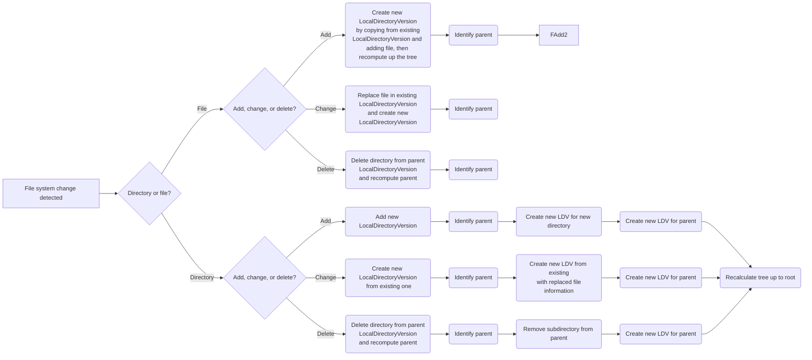

# Processing file system changes

## Processing file and directory changes

```mermaid
flowchart LR
    A[File system change detected] --> B{Directory or file?}
    B -->|File| F{Add, change, or delete?}
    B -->|Directory| D{Add, change, or delete?}
    F -->|Add| FAdd(Create new LocalDirectoryVersion<br> by copying from existing <br>LocalDirectoryVersion and <br>adding file, then <br>recompute up the tree)
    FAdd --> FAdd1(Identify parent)
    FAdd1 --> FAdd2
    FChange --> FChange1(Identify parent)
    FDelete --> FDelete1(Identify parent)
    F -->|Change| FChange(Replace file in existing LocalDirectoryVersion<br> and create new LocalDirectoryVersion)
    F --> |Delete| FDelete(Delete directory from parent <br>LocalDirectoryVersion<br> and recompute parent)
    R(Recalculate tree up to root)
    D -->|Add| DAdd(Add new LocalDirectoryVersion)
    D -->|Change| DChange(Create new LocalDirectoryVersion<br> from existing one)
    D --> |Delete| DDelete(Delete directory from parent <br>LocalDirectoryVersion<br> and recompute parent)
    DAdd --> DAdd1(Identify parent)
    DAdd1 --> DAdd2(Create new LDV for new directory)
    DAdd2 --> DAdd3(Create new LDV for parent)
    DAdd3 --> R
    DChange --> DChange1(Identify parent)
    DChange1 --> DChange2(Create new LDV from existing<br> with replaced file information)
    DChange2 --> DChange3(Create new LDV for parent)
    DChange3 --> R
    DDelete --> DDelete1(Identify parent)
    DDelete1 --> DDelete2(Remove subdirectory from parent)
    DDelete2 --> DDelete3(Create new LDV for parent)
    DDelete3 --> R
```
